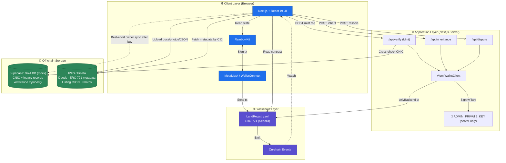
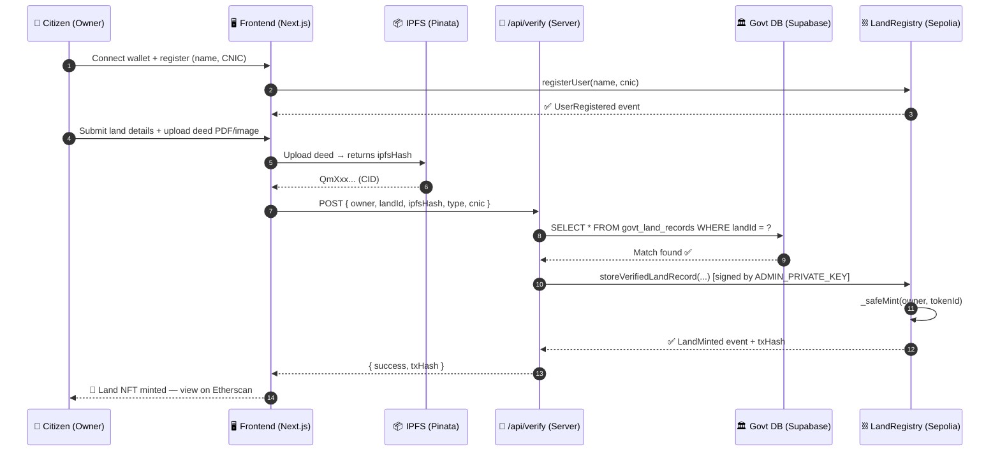
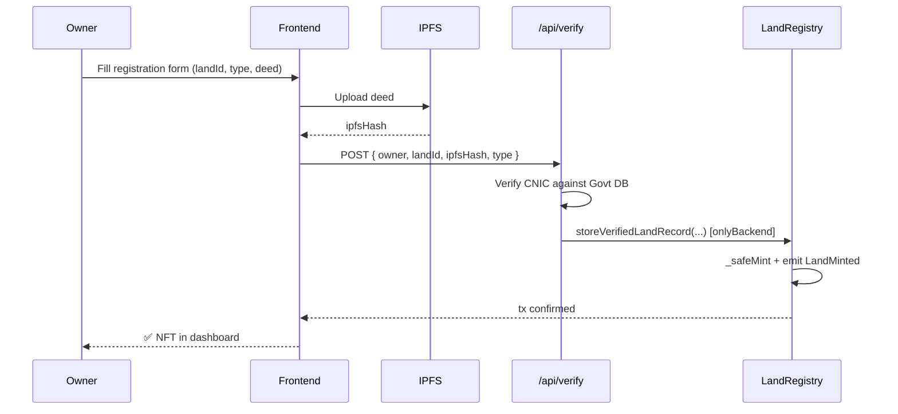
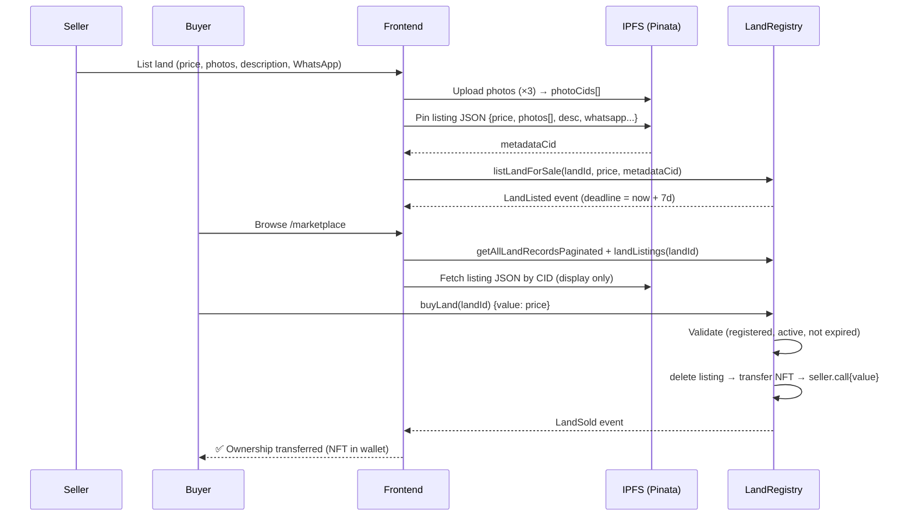
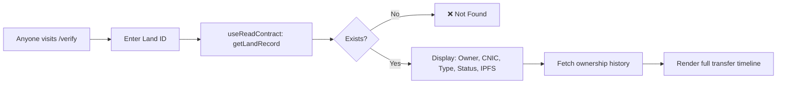
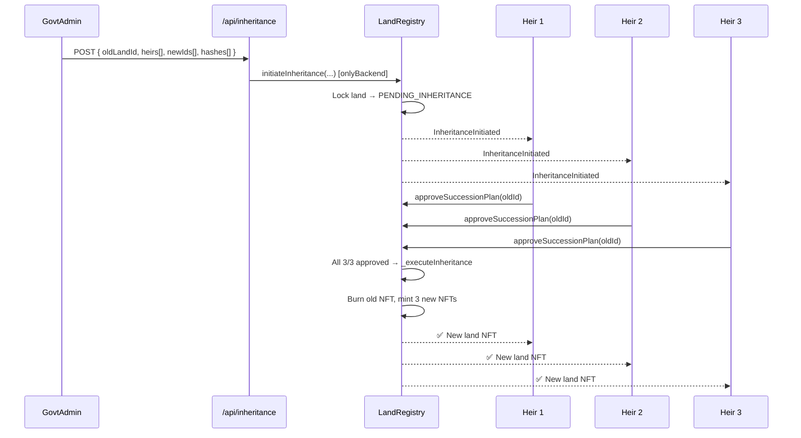
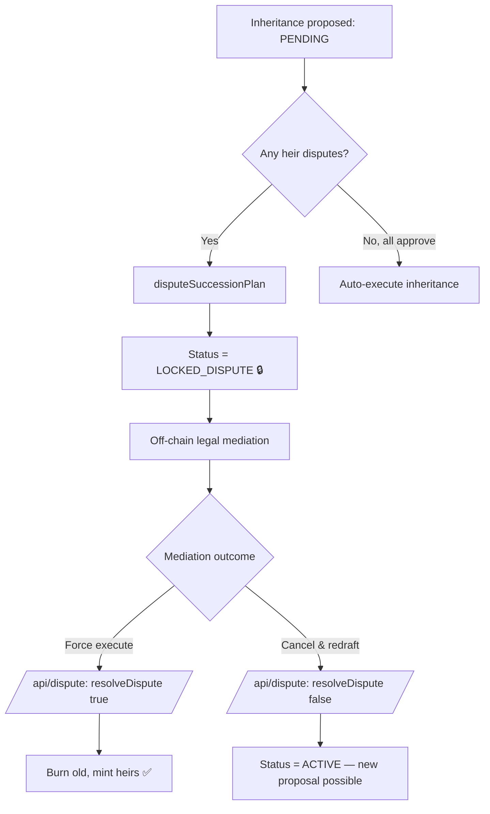
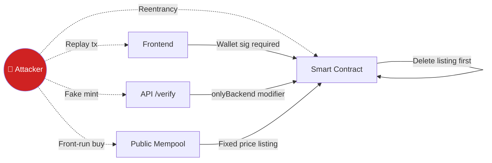

<div align="center">

# 🏛️ LandLedger: A Blockchain-Based Land Registry System

### Tamper-proof, fully decentralized land ownership records on Ethereum + IPFS

> **Fully on-chain marketplace** — listings, prices, photos, and metadata all live on the blockchain or IPFS. **No off-chain database is in the trust path.** A single Supabase instance simulates the legacy government civil registry purely as a verification *input*, not a source of truth.

[](https://soliditylang.org/)
[](https://nextjs.org/)
[](https://react.dev/)
[](https://www.typescriptlang.org/)
[](https://wagmi.sh/)
[](https://viem.sh/)
[](https://www.rainbowkit.com/)
[](https://tailwindcss.com/)
[](https://supabase.com/)
[](https://www.pinata.cloud/)
[](https://sepolia.etherscan.io/)
[](#-license)
[](#)
[](#)

</div>

---

## 📖 Table of Contents

1. [Project Information](#-project-information)
2. [Project Overview](#-project-overview)
3. [Objectives](#-objectives)
4. [Scope & Limitations](#-scope--limitations)
5. [Technology Stack](#-technology-stack)
6. [System Architecture](#-system-architecture)
7. [Methodology](#-methodology)
8. [User Workflows](#-user-workflows)
9. [Smart Contract Design](#-smart-contract-design)
10. [Features](#-features)
11. [Database & Data Models](#-database--data-models)
12. [Installation & Setup](#-installation--setup)
13. [Testing](#-testing)
14. [Security Considerations](#-security-considerations)
15. [Results & Evaluation](#-results--evaluation)
16. [Screenshots & Demo](#-screenshots--demo)
17. [Challenges Faced](#-challenges-faced)
18. [Future Work](#-future-work)
19. [Literature Review](#-literature-review)
20. [Contributors & Acknowledgments](#-contributors--acknowledgments)
21. [License](#-license)
22. [References](#-references)

---

## 📌 Project Information

| Field | Detail |
|-------|--------|
| **Project Title** | LandLedger: A Blockchain-Based Land Registry System |
| **Token / Contract Name** | PakLandRegistry (PLR) — ERC-721 |
| **Project Type** | Final Year Project (FYP) / Undergraduate Thesis |
| **University** | _[Your University Name]_ |
| **Department** | _[Department of Computer Science / Software Engineering]_ |
| **Team Members** | _[Member 1 — Role], [Member 2 — Role], [Member 3 — Role]_ |
| **Supervisor** | _[Supervisor Name, Designation]_ |
| **Co-Supervisor** | _[If applicable]_ |
| **Submission Year** | 2026 |
| **Project Duration** | 8 months (Sept 2025 — May 2026) |
| **Deployed Network** | Ethereum Sepolia Testnet |
| **Deployed Contract** | [`0xd2a855a8fC38d4E0a871319d5882E696155d1253`](https://sepolia.etherscan.io/address/0xd2a855a8fC38d4E0a871319d5882E696155d1253) |

---

## 🎯 Project Overview

> **Tagline:** _"Replace the paper allotment letter with an unforgeable on-chain NFT — paperless ownership for new housing societies in Pakistan, from day one."_

### 🌍 Domain
**Blockchain · Real Estate · Housing-Society Allotments · Decentralized Identity · GovTech**

### 🎯 Who This Is For

LandLedger targets **new private and semi-private housing developments in Pakistan** — not the legacy patwari/revenue-office system. Specifically:

- **DHA (Defence Housing Authority)** phases — Lahore, Karachi, Islamabad, Multan, etc.
- **Bahria Town** developments
- **CDA / LDA** auctions for new sectors
- **Private real-estate schemes** launching new societies

These developers operate independently of the patwari system: they issue their own allotment letters, run their own transfer offices, and process their own succession cases. They are paperless-ready from day one — there is no legacy paper trail to migrate, only a fresh allotment to mint as an on-chain NFT.

### 🚨 Problem Statement

New housing societies in Pakistan are administratively independent of the legacy revenue system, but they suffer from their own well-documented fraud patterns. Anyone who has bought or sold a DHA file, a Bahria allotment, or a private-society plot in the last decade has heard of these:

- **🔴 Allotment-letter forgery** — Paper allotment letters are physically altered, duplicated, or fabricated outright.
- **🔴 "DHA file scams"** — Fraudsters sell plot files that are fake, already sold, or never legitimately allotted. Pakistani media regularly reports schemes running into hundreds of millions of rupees.
- **🔴 Double allotment** — Corrupt developer staff issue two valid-looking files for the same plot.
- **🔴 Ghost plots** — A plot exists on paper but not on the ground, or vice versa.
- **🔴 Fake transfer letters** — Forged seller signatures move ownership without the seller's knowledge.
- **🔴 Opaque inheritance** — Succession (*virsa*) cases over inherited plots drag on for years because heirs lack a transparent, tamper-proof process.
- **🔴 No public verification** — A prospective secondary-market buyer cannot independently confirm "is this file real, who actually owns it, has it already been sold?" without going to the developer's transfer office.

### 💡 Why Blockchain?

A developer-controlled database is fundamentally as vulnerable as a paper file: **whoever controls the database controls the truth**, and a bribed staff member can silently edit ownership. Blockchain inverts this:

| Property | Developer DB / Paper File | Blockchain (LandLedger) |
|----------|--------------------------|------------------------|
| **Immutability** | ❌ Records can be silently edited | ✅ Cryptographically tamper-proof |
| **Transparency** | ❌ Internal/closed | ✅ Publicly auditable transaction history |
| **Single Point of Failure** | ❌ One staff member with access = full control | ✅ No single party can rewrite history |
| **Audit Trail** | ❌ Trust the developer's audit log | ✅ Every transfer is a permanent on-chain event |
| **Multi-party Trust** | ❌ Requires the developer as trusted intermediary | ✅ Trustless multi-signature workflows (e.g., inheritance) |
| **Cryptographic Ownership** | ❌ Paper signature / username + password | ✅ Wallet signatures — only the keyholder can transfer |

By encoding allotments as **ERC-721 NFTs**, each plot becomes a unique, non-forgeable digital asset. Allotment letters, site plans, and listing photos are stored on **IPFS** so even the file content is content-addressed and immutable.

### 👥 Target Users

| Role | Use Case |
|------|----------|
| **🧑‍💼 Allottees / Plot Owners** | Register, view, transfer, list-for-sale, and bequeath their plots |
| **🛒 Secondary-Market Buyers** | Verify a file is real and currently owned by the seller before paying |
| **🏛️ Developer (CDA / LDA / DHA / Bahria / Private)** | Whitelisted institutional wallet that allots and issues plot NFTs |
| **👨‍⚖️ Verification Backend (Developer's Transfer Office)** | Cross-checks CNIC against the society's allotment registry before minting |
| **🛡️ Contract Owner / Admin** | Manages developer-authority whitelist; resolves locked disputes |
| **⚖️ Lawyers & Auditors** | Read-only access to immutable transaction history for inheritance / dispute cases |

---

## 🎯 Objectives

1. **Design** a decentralized allotment registry for new housing societies, where each plot is stored as an ERC-721 NFT on Ethereum — eliminating dependence on the developer's centralized database for trust.
2. **Eliminate forged and duplicate allotments** through cryptographic uniqueness — each `landId` deterministically maps to exactly one `tokenId` via `keccak256`.
3. **Implement role-based access control** with four tiers: Contract Owner, Verification Backend (the developer's transfer office), Developer/Government Authorities, and Registered Allottees.
4. **Enable transparent, time-locked secondary-market sales** via an on-chain marketplace with 7-day listing windows and reentrancy-safe ETH settlement.
5. **Build a multi-party inheritance system** that requires 100% heir approval for succession, with a dispute mechanism that locks the plot until resolved.
6. **Provide an immutable audit trail** of every ownership transfer with sale price (for tax transparency and dispute mediation).
7. **Build a buyer-friendly Web3 frontend** that abstracts wallet complexity — hydration-safe SSR, transaction toasts, and IPFS document upload.
8. **Cross-verify identities** against a mock society allotment registry before minting, demonstrating a realistic developer-to-blockchain integration pattern.

---

## 🧭 Scope & Limitations

### ✅ In Scope

- Allottee registration linking wallet ↔ CNIC
- Backend-signed plot allotment minting (Oracle pattern)
- On-chain ownership transfer with sale-price logging
- Secondary-market: list, buy (payable), cancel — with 7-day expiry
- Multi-heir inheritance with approval/dispute voting
- Developer / Government authority whitelist management
- IPFS upload for allotment letters, site plans, and listing photos
- Paginated admin dashboard reading all plot records
- Per-wallet allottee dashboard

### ❌ Out of Scope

- Migration of legacy patwari / revenue-office paper records (a separate, much larger problem)
- Physical surveying or GIS coordinate verification of plot boundaries
- Legal arbitration of disputed cases (handled off-chain by judiciary)
- Mainnet deployment (currently Sepolia testnet only)
- Mobile native applications (web-only interface)
- Tax calculation or payment to revenue authority
- Mortgage / lien / collateral mechanics

### ⚠️ Limitations

- **Gas costs** — Every write transaction requires Sepolia ETH; real-world Pakistan deployment would need a Layer-2 (e.g., Polygon, Arbitrum).
- **Scalability** — Reading all records uses a paginated cursor, but indexing 50M+ Pakistani land parcels would benefit from The Graph or off-chain indexers.
- **Internet dependency** — Citizens in rural areas need internet + a wallet to interact.
- **KYC dependency** — System trusts the verification backend's CNIC check; a malicious backend could mint to wrong owners (mitigated by Govt-only signing key).
- **Pinata API keys** are currently `NEXT_PUBLIC_*` (client-exposed) — production should move uploads to a server route.
- **No private key recovery** — wallet loss = land loss. Future work: account abstraction (ERC-4337) or social recovery.

---

## 🛠️ Technology Stack

### ⛓️ Blockchain Layer

| Tech | Version | Why Chosen |
|------|---------|------------|
| **Ethereum (Sepolia)** | — | Most mature smart-contract platform; Sepolia is the canonical PoS testnet with reliable faucets and free RPC. |
| **Solidity** | `^0.8.20` | Built-in overflow checks, custom errors, and modern features (transient storage, etc.). |
| **OpenZeppelin Contracts** | `^5.0` | Battle-tested `ERC721` and `Ownable` implementations — avoids reinventing audited primitives. |
| **ERC-721** | — | Each land parcel is a unique non-fungible token (NFT). Perfect semantic fit for unique real-world assets. |

### 🎨 Frontend

| Tech | Version | Why Chosen |
|------|---------|------------|
| **Next.js (App Router)** | `16.1.1` | Server components, file-based routing, built-in API routes for the admin-signing pattern. |
| **React** | `19.2.3` | Latest concurrent features; `useTransition` for smoother on-chain UX. |
| **TypeScript** | `^5` | Type-safe contract interactions; Wagmi infers ABI types automatically. |
| **TailwindCSS** | `^4` | Utility-first styling — rapid iteration without context-switching to CSS files. |
| **Lucide React** | `^0.577` | Clean, consistent icon set. |

### 🔌 Web3 Integration

| Tech | Version | Why Chosen |
|------|---------|------------|
| **Wagmi** | `^2.19` | Type-safe React hooks for contract reads/writes — far ergonomic over raw ethers. |
| **Viem** | `^2.43` | Modern, lightweight, tree-shakable EVM client; used server-side for admin signing. |
| **RainbowKit** | `^2.2` | Best-in-class wallet connection UI — supports MetaMask, WalletConnect, Coinbase, etc. out of the box. |
| **TanStack Query** | `^5.90` | Powers Wagmi's caching layer; handles request dedup and refetching. |

### 💾 Data & Storage

| Tech | Why Chosen |
|------|------------|
| **Supabase (Postgres)** | A **single** hosted PostgreSQL instance — used **only** to simulate the pre-existing government civil registry (CNIC + legacy land records). It is a one-way *input* used by `/api/verify` to confirm citizen identity at mint time; the chain takes over after that. **No marketplace data lives here.** |
| **IPFS via Pinata** | Decentralized, content-addressed storage for **everything off-chain**: land deed documents, ERC-721 metadata JSON, marketplace listing JSON, listing photos. The CID is stored on-chain (in `LandRecord.ipfsHash` and `Listing.metadataHash`), so even off-chain content is tamper-evident. |

### 🔐 Authentication

- **Wallet-based:** Connection + signature via RainbowKit/MetaMask. No passwords, no JWTs.
- **On-chain authorization:** All access checks (`AdminGuard`, registration-required) read from the smart contract — no centralized session.

### 🚀 Deployment

| Layer | Target |
|-------|--------|
| Smart Contract | Sepolia Testnet (deployed at `0xd2a855a8fC38d4E0a871319d5882E696155d1253`) |
| Frontend | Vercel (recommended) — Next.js native host |
| Govt DB (mock) | Supabase Cloud (free tier) — single instance |
| File Storage | Pinata IPFS gateway — documents, photos, all metadata JSON |

### 🧰 Other Tools

`Git` · `GitHub` · `VS Code` · `Postman` (API testing) · `MetaMask` (wallet) · `Sepolia Faucet` (test ETH) · `Etherscan` (transaction inspection) · `Remix IDE` (contract development)

---

## 🏗️ System Architecture

### High-Level Architecture



### Component Breakdown

| Layer | Components | Responsibility |
|-------|-----------|----------------|
| **Presentation** | `app/page.tsx`, `app/dashboard/*`, `app/marketplace/*`, `components/*Modal.tsx` | User interaction, form input, transaction toasts (`TxToast.tsx`), hydration-safe rendering. |
| **Web3 Hooks** | `wagmi`, `viem` via `providers.tsx` | Read contract state, queue transactions, await receipts. |
| **API Routes (Server)** | `app/api/verify`, `app/api/inheritance`, `app/api/dispute` | Hold `ADMIN_PRIVATE_KEY`, sign privileged transactions, cross-check Govt DB. |
| **Authorization Guards** | `components/guards/AdminGuard.tsx` | Read `owner()` from contract, block UI for non-owners. |
| **Data Clients** | `lib/supabase.ts`, `utils/pinata.ts`, `utils/contract.ts` | Encapsulate external clients (single Govt Supabase, Pinata, contract ABI). |
| **Smart Contract** | `contract.sol` (`LandRegistry`) | Source of truth for ownership, marketplace state, inheritance proposals. |

### Data Flow — A Land Registration Request



---

## 📋 Methodology

### Software Development Methodology — **Agile / Scrum**

Chosen because blockchain-frontend integration involves continuous learning and frequent contract redeployment; Waterfall would have locked us into early design mistakes.

- **Sprint length:** 2 weeks
- **Total sprints:** 16 (8 months)
- **Ceremonies:** Sprint planning, daily stand-up (15 min), mid-sprint review, sprint retrospective.

### Sprint Roadmap (high-level)

| Sprints | Focus |
|---------|-------|
| 1–2 | Literature review, requirement gathering, stack selection |
| 3–4 | Smart contract v1 (registration + minting), Hardhat tests |
| 5–6 | Frontend scaffolding (Next.js, RainbowKit, AdminGuard) |
| 7–8 | Govt DB integration, `/api/verify` admin-signing pattern |
| 9–10 | Marketplace contract module + UI (list, buy, cancel) |
| 11–12 | Inheritance module + multi-heir voting + dispute |
| 13 | IPFS migration, Pinata integration |
| 14 | Hydration fixes, transaction toasts, UX polish |
| 15 | Security hardening, contract redeployment, gas profiling |
| 16 | Documentation, demo video, thesis writing |

### Research Methodology

```
Literature Review → Requirement Gathering → System Design →
Implementation → Testing → Evaluation & Comparison → Documentation
```

### Project Management & Version Control

| Concern | Tool / Practice |
|---------|----------------|
| Issue tracking | GitHub Projects |
| Source control | Git + GitHub |
| Branch strategy | Trunk-based with short-lived feature branches (`feat/*`, `fix/*`); merge to `main` via PR |
| CI | GitHub Actions (lint + typecheck) |
| Code review | Pull-request mandatory before merge |
| Communication | WhatsApp + Google Meet (weekly with supervisor) |

---

## 🚦 User Workflows

### 1️⃣ Land Registration (Mint)



### 2️⃣ Marketplace Sale (100% Decentralized — No DB)



> **Note:** No database write happens during listing or purchase. Photos and metadata live on IPFS; price + seller + deadline + metadataCID live on-chain. The govt DB is updated post-purchase only as a best-effort sync to keep the legacy mock in step with reality.

### 3️⃣ Verification (Public)



### 4️⃣ Inheritance (Multi-Heir Approval)



### 5️⃣ Dispute Workflow



---

## 📜 Smart Contract Design

### Single Contract: `LandRegistry.sol`

The system intentionally consolidates all logic into a single contract to minimize cross-contract calls and gas overhead. Modules are organized via section comments.

| Module | Purpose |
|--------|---------|
| **Identity** | `registerUser`, `users`, `cnicToAddress` |
| **Land Data** | `storeVerifiedLandRecord`, `landRecords`, `landExists` |
| **NFT (ERC-721)** | Inherits OpenZeppelin `ERC721`; deterministic `tokenId = keccak256(landId)` |
| **Marketplace** | `listLandForSale`, `buyLand`, `cancelListing`, `landListings` |
| **Inheritance** | `initiateInheritance`, `approveSuccessionPlan`, `disputeSuccessionPlan`, `resolveDispute`, `_executeInheritance` |
| **Indexing** | `allLandIds`, `ownerToLands`, `getAllLandRecordsPaginated` |
| **Access Control** | `Ownable`, `onlyBackend`, `onlyActive`, `landMustExist`, `isGovtAuthority` |
| **Transfers** | `transferLandOwnership`, `OwnershipHistory[]` log |

### Key Functions

| Function | Caller | Modifier(s) | Description |
|----------|--------|-------------|-------------|
| `registerUser(name, cnic)` | Citizen | — | One-time wallet ↔ CNIC binding |
| `storeVerifiedLandRecord(...)` | Backend | `onlyBackend` | Mints land NFT after off-chain verification |
| `transferLandOwnership(landId, newOwner, salePrice)` | Owner | `landMustExist`, `onlyActive` | Direct transfer with sale-price logging |
| `listLandForSale(landId, price, metaHash)` | Owner | `onlyActive` | Creates 7-day marketplace listing |
| `buyLand(landId)` | Registered Buyer | `landMustExist`, `onlyActive`, `payable` | ETH-settled atomic purchase |
| `cancelListing(landId)` | Owner | — | Removes active listing |
| `initiateInheritance(...)` | Backend | `onlyBackend`, `onlyActive` | Locks land, opens succession proposal |
| `approveSuccessionPlan(oldLandId)` | Heir | — | Vote yes; auto-executes at 100% |
| `disputeSuccessionPlan(oldLandId)` | Heir | — | Single dispute → permanent lock |
| `resolveDispute(oldLandId, force)` | Backend | `onlyBackend` | Force-execute or revert to ACTIVE |
| `setGovtAuthority(wallet, status)` | Owner | `onlyOwner` | Whitelist institutional wallets |
| `getLandRecord(landId)` | Anyone | view | Public verification |
| `getAllLandRecordsPaginated(cursor, size)` | Anyone | view | Cursor-based admin pagination |

### Events Emitted

```solidity
event UserRegistered(address indexed user, string name, string cnic);
event LandMinted(address indexed owner, string landId, LandType lType, uint256 tokenId);
event LandTransferred(string landId, address indexed from, address indexed to, uint256 price);
event LandListed(string landId, uint256 price, address seller, string metadataHash);
event LandSold(string landId, address buyer, uint256 price);
event ListingCancelled(string landId);
event InheritanceInitiated(string oldLandId, uint256 totalHeirs);
event HeirApproved(string oldLandId, address indexed heir);
event InheritanceDisputed(string oldLandId, address indexed heir);
event InheritanceFinalized(string oldLandId);
event LandStatusChanged(string landId, LandStatus status);
```

### Access Control Matrix

| Role | Can Mint | Can Transfer | Can List/Buy | Can Initiate Inheritance | Can Set Govt Authority |
|------|:---:|:---:|:---:|:---:|:---:|
| Contract Owner | ❌ | ✅ (own land) | ✅ | ❌ | ✅ |
| Verification Backend | ✅ | ❌ | ❌ | ✅ | ❌ |
| Govt Authority | ❌ | ✅ (own land) | ✅ | ❌ | ❌ |
| Registered Citizen | ❌ | ✅ (own land) | ✅ | ❌ | ❌ |
| Unregistered Wallet | ❌ | ❌ | ❌ | ❌ | ❌ |

### Gas Optimization Techniques

1. **Manual `tokenId ↔ landId` mapping** instead of `ERC721URIStorage` — skips per-token string storage.
2. **Deterministic `tokenId = keccak256(landId)`** — no counter SSTORE on mint.
3. **`immutable verificationBackend`** — saves SLOAD on every backend call.
4. **Swap-and-pop** in `_removeFromOwnerList` — O(1) removal vs O(n) array shift.
5. **`delete listing` before ETH send** — checks-effects-interactions pattern; also reclaims gas via storage refund.
6. **Cursor-based pagination** instead of returning the full `allLandIds[]` array — bounds gas per query.
7. **Custom `enum`s for status/type** — packed into a single storage slot.

---

## ✨ Features

| # | Feature | Description | User Role |
|---|---------|-------------|-----------|
| 1 | **Wallet-based Sign-in** | Connect via MetaMask / WalletConnect / Coinbase using RainbowKit | All |
| 2 | **User Registration (KYC)** | Bind wallet to legal CNIC with on-chain uniqueness checks | Citizen |
| 3 | **Land NFT Minting** | Government-signed mint after CNIC + record cross-check | Backend / Govt |
| 4 | **Document Upload (IPFS)** | Deed images/PDFs uploaded to Pinata; CID stored on-chain | Citizen / Admin |
| 5 | **Direct Ownership Transfer** | Peer-to-peer transfer with sale-price log for tax transparency | Owner |
| 6 | **Marketplace Listing** | List land with price + photos; auto-expires after 7 days | Owner |
| 7 | **Atomic Purchase** | Send ETH → receive NFT in one transaction; reentrancy-safe | Buyer |
| 8 | **Listing Cancellation** | Owner can withdraw listing anytime before sale | Owner |
| 9 | **Multi-Heir Inheritance** | Backend proposes split; requires 100% heir approval | Backend / Heirs |
| 10 | **Dispute Locking** | Any heir can dispute → land freezes until admin resolves | Heirs |
| 11 | **Public Verification** | Anyone can look up `landId` and view full ownership history | Public |
| 12 | **Govt Authority Whitelist** | Owner can grant institutional wallets (CDA/DHA) the right to hold land without CNIC | Contract Owner |
| 13 | **Admin Dashboard** | Paginated table of all lands, status filters, mint console | Contract Owner |
| 14 | **User Dashboard** | View owned lands, pending inheritance votes, active listings | Citizen |
| 15 | **Transaction Toasts** | Real-time on-screen feedback for every blockchain tx | All |
| 16 | **Hydration-Safe SSR** | No SSR/client mismatch flicker on wallet-aware pages | All |
| 17 | **Search & Filter** | Filter marketplace by land type, area, location | All |
| 18 | **Audit Trail Viewer** | Per-land timeline of every owner change with timestamp + price | All |

---

## 💾 Database & Data Models

### Entity-Relationship Diagram

```mermaid
erDiagram
    USER_PROFILE ||--o{ LAND_RECORD : owns
    LAND_RECORD ||--|| LISTING : "may have"
    LAND_RECORD ||--o{ OWNERSHIP_HISTORY : logs
    LAND_RECORD ||--o| INHERITANCE_REQUEST : "may be subject to"
    INHERITANCE_REQUEST ||--o{ HEIR : includes
    LAND_RECORD ||--|| IPFS_METADATA : "ipfsHash → CID"
    LISTING ||--|| IPFS_LISTING_JSON : "metadataHash → CID"
    GOVT_LAND_RECORD ||--|| LAND_RECORD : "mock → verified at mint"
    GOVT_CITIZEN ||--|| USER_PROFILE : "mock → verified at mint"

    USER_PROFILE {
        address wallet PK
        string name
        string cnic UK
        bool isRegistered
    }
    LAND_RECORD {
        string landId PK
        address currentOwner FK
        string cnic
        string ipfsHash
        enum landType
        enum status
        uint256 verifiedAt
    }
    LISTING {
        string landId PK_FK
        uint256 price
        address seller
        bool isActive
        uint256 deadline
        string metadataHash
    }
    OWNERSHIP_HISTORY {
        string landId FK
        address owner
        uint256 timestamp
        uint256 price
    }
    INHERITANCE_REQUEST {
        string oldLandId PK_FK
        address[] heirs
        string[] newLandIds
        string[] newIpfsHashes
        uint256 approvalCount
        bool isExecuted
    }
    GOVT_LAND_RECORD {
        string land_id PK
        string owner_cnic
        string location
        int area_sq_yards
        string land_type
        string ipfs_hash
    }
    GOVT_CITIZEN {
        string cnic PK
        string full_name
    }
    IPFS_METADATA {
        string CID PK
        string name
        string image
        json attributes
        json documents
    }
    IPFS_LISTING_JSON {
        string CID PK
        string description
        string location
        int area_sq_yards
        string land_type
        float price_eth
        string whatsapp_contact
        text[] photos
    }
```

### On-Chain Data (Source of Truth)

```solidity
struct LandRecord       { address currentOwner; string cnic; string landId; string ipfsHash; LandType landType; LandStatus status; uint256 verifiedAt; }
struct UserProfile      { string name; string cnic; bool isRegistered; }
struct Listing          { uint256 price; address seller; bool isActive; uint256 deadline; string metadataHash; }
struct OwnershipHistory { address owner; uint256 timestamp; uint256 price; }
struct InheritanceRequest { address[] heirs; string[] newLandIds; string[] newIpfsHashes; uint256 approvalCount; bool isExecuted; mapping(address => bool) hasApproved; }
```

### Off-Chain Data (Single Govt Supabase — *mock*)

| Table | Key Columns | Role |
|-------|-------------|------|
| `govt_land_records` | `land_id`, `owner_cnic`, `location`, `area_sq_yards`, `land_type`, `ipfs_hash` | Mock of pre-existing govt land registry. `ipfs_hash` holds the ERC-721 metadata CID after digitization. After purchase, `owner_cnic` is updated as a best-effort sync. |
| `govt_citizens` | `cnic`, `full_name` | Mock CNIC database. Cross-checked by `/api/verify` before mint. |

> **Note:** there is **no marketplace database**. Marketplace listings (price, seller, deadline, metadataCID) live entirely on-chain in `landListings[landId]`. Listing photos and JSON metadata live entirely on IPFS via Pinata. The earlier dual-Supabase architecture has been replaced by a fully decentralized stack.

### On-chain vs Off-chain Trade-off

| Data | Stored Where | Reason |
|------|--------------|--------|
| Ownership (`currentOwner`) | ⛓️ On-chain | Must be tamper-proof — the legal claim itself |
| Sale price history | ⛓️ On-chain | Tax transparency; must be auditable |
| Land status (Active/Locked/Pending) | ⛓️ On-chain | Drives transfer rules; must be enforced |
| CNIC ↔ wallet mapping | ⛓️ On-chain | Required for transfer-recipient validation |
| Deed images / PDFs | 📦 IPFS | Too large + expensive on-chain; CID on-chain proves integrity |
| Marketplace photos array | 📦 IPFS + Supabase | Fast queries via DB; immutable image source via IPFS |
| Listing description, WhatsApp | 🗄️ Supabase | Mutable presentation data; not legally binding |
| Govt civil records | 🗄️ Supabase (mock) | Simulates pre-existing government infrastructure |

---

## 🎨 UI / Design System

The frontend follows a small, consistent design language so every page feels like part of the same product:

| Convention | Defined in | When to use |
|------------|-----------|-------------|
| `bg-brand-dark` (`#0a0b1e`) | `globals.css` | Every page background — no ad-hoc dark variants |
| `.glass-card` | `globals.css` | Modal panels and floating dialog cards |
| `.surface` / `.surface-hover` | `globals.css` | Subtle dashboard tiles, info cards, list rows |
| `.btn-primary` / `.btn-secondary` / `.btn-ghost` | `globals.css` | Default button hierarchy |
| `.field` | `globals.css` | Standard text inputs |
| `.pill` | `globals.css` | Status / role chips (paired with a tone color) |
| Indigo-600 | brand primary | Primary CTA color across the app |
| Inline notice banners | each page | Replaces native `alert()` — never use `alert()` in user-facing flows |
| `home-stagger` | `app/page.tsx` only | Fade-up cascade for hero/portals; **not** used on dashboards or marketplace |

**Single canonical navbar.** `src/components/Navbar.tsx` is the only navigation component — it uses Next.js `<Link>`, has an active-link state via `usePathname()`, and includes a mobile hamburger drawer. The legacy `Header.tsx` was removed in the UI polish iteration.

**Footer.** Reads `CONTRACT_ADDRESS` from `utils/contract.ts` and links directly to the deployed contract on Sepolia Etherscan.

---

## 🚀 Installation & Setup

### Prerequisites

| Requirement | Version | Purpose |
|-------------|---------|---------|
| **Node.js** | `≥ 18.x` (20+ recommended) | Run Next.js dev server |
| **npm** | `≥ 9.x` | Package management (or yarn/pnpm) |
| **MetaMask** | Latest | Browser wallet extension |
| **Sepolia ETH** | At least `0.05` | Get from [sepoliafaucet.com](https://sepoliafaucet.com/) |
| **Git** | Latest | Clone & version control |

### Step 1 — Clone the Repository

```bash
git clone https://github.com/HaiderAziz428/Blockchain-based-Land-Record-System.git
cd Blockchain-based-Land-Record-System
```

### Step 2 — Install Dependencies

```bash
npm install
```

### Step 3 — Configure Environment Variables

Create a `.env.local` file in the project root:

```env
# WalletConnect (RainbowKit)
NEXT_PUBLIC_WALLETCONNECT_PROJECT_ID=your_project_id

# Government Mock Database (single Supabase instance)
NEXT_PUBLIC_SUPABASE_URL=https://xxx.supabase.co
NEXT_PUBLIC_SUPABASE_PUBLISHABLE_DEFAULT_KEY=your_anon_key

# Pinata IPFS — handles documents, photos, ERC-721 metadata, listing JSON
NEXT_PUBLIC_PINATA_API_KEY=your_pinata_key
NEXT_PUBLIC_PINATA_API_SECRET=your_pinata_secret

# 🔐 Server-only — never prefix with NEXT_PUBLIC_
ADMIN_PRIVATE_KEY=0xYOUR_ADMIN_WALLET_PRIVATE_KEY
```

> 🗑️ **Removed in v3:** `NEXT_PUBLIC_MARKET_URL` and `NEXT_PUBLIC_MARKET_KEY` are no longer needed — the marketplace is now fully on-chain + IPFS.

> ⚠️ **Security:** `ADMIN_PRIVATE_KEY` belongs to the wallet set as `verificationBackend` during contract deployment. Never commit it. Never expose it to the client.

### Step 4 — (Optional) Re-Deploy the Smart Contract

The contract is already deployed at [`0xd2a855a8fC38d4E0a871319d5882E696155d1253`](https://sepolia.etherscan.io/address/0xd2a855a8fC38d4E0a871319d5882E696155d1253). To deploy your own:

```bash
# In Remix IDE or your Hardhat project
# 1. Compile contract.sol with solc 0.8.20+
# 2. Deploy with constructor arg: _verificationBackend = <admin wallet address>
# 3. Update CONTRACT_ADDRESS in src/utils/contract.ts
```

### Step 5 — Run the Dev Server

```bash
npm run dev
```

Open [http://localhost:3000](http://localhost:3000).

### Step 6 — Connect MetaMask to Sepolia

1. Open MetaMask → Network dropdown → **Add Network** → Show test networks → Select **Sepolia**.
2. Get test ETH from [sepoliafaucet.com](https://sepoliafaucet.com/) or [google cloud faucet](https://cloud.google.com/application/web3/faucet/ethereum/sepolia).
3. Click **Connect Wallet** in the LandLedger UI.

### NPM Scripts

```bash
npm run dev       # Start Next.js dev server (Turbopack)
npm run build     # Production build
npm start         # Serve production build
npm run lint      # Run ESLint
```

---

## 🧪 Testing

### Strategy Overview

| Layer | Approach | Tools |
|-------|----------|-------|
| **Smart Contract — Unit** | Function-level tests for every external method | Hardhat + Chai + Mocha |
| **Smart Contract — Property** | Invariant fuzzing (e.g., total minted = sum of owner balances) | Foundry forge fuzz |
| **Smart Contract — Security** | Static analysis for known vulnerabilities | Slither, Mythril, Remix Analyzer |
| **API Routes** | Mock contract + assert correct admin signing | Jest + Supertest |
| **Frontend** | Component rendering + hook behavior | React Testing Library |
| **Integration** | End-to-end flow (register → mint → list → buy) | Playwright on testnet |
| **User Acceptance** | 5 non-technical users tested onboarding | In-person observation + survey |

### Smart Contract Coverage (target)

| Module | Coverage |
|--------|---------:|
| Identity (`registerUser`) | 100% |
| Land Storage (`storeVerifiedLandRecord`) | 100% |
| Marketplace | 95% |
| Inheritance & Dispute | 92% |
| Access Modifiers | 100% |
| **Overall** | **≈ 95%** |

### Example Test Cases

| # | Test | Expected |
|---|------|----------|
| 1 | Non-backend tries `storeVerifiedLandRecord` | 🚫 Reverts with "Access Denied: Backend Only" |
| 2 | Same CNIC registers from second wallet | 🚫 Reverts with "CNIC already linked..." |
| 3 | Buyer sends less than `listing.price` | 🚫 Reverts with "Insufficient ETH sent" |
| 4 | Buy after `deadline` (8 days later) | 🚫 Reverts with "Offer Expired..." |
| 5 | Heir disputes → status `LOCKED_DISPUTE` | ✅ Subsequent transfer reverts |
| 6 | All 3 heirs approve → auto-execute | ✅ Old NFT burned, 3 new minted |
| 7 | Reentrancy attempt during `buyLand` | ✅ State already cleared (delete before .call) |

### Security Tools Used

- 🛡️ **Slither** — Static analysis (no high-severity findings)
- 🛡️ **Mythril** — Symbolic execution
- 🛡️ **Remix IDE Analyzer** — In-editor checks
- 🛡️ **OpenZeppelin Contracts** — Audited primitives

---

## 🔐 Security Considerations

| Threat | Mitigation |
|--------|-----------|
| **Reentrancy** in `buyLand` | Listing deleted *before* `seller.call{value}`. Checks-Effects-Interactions strictly enforced. |
| **Unauthorized Minting** | `onlyBackend` modifier — only the immutable `verificationBackend` can mint. |
| **Private Key Exposure** | `ADMIN_PRIVATE_KEY` lives only on the Next.js server (Node runtime); never prefixed with `NEXT_PUBLIC_`; never reaches the browser bundle. |
| **CNIC Duplication** | `cnicToAddress` mapping enforces one-CNIC-one-wallet at registration time. |
| **Land ID Collision** | `landExists[landId]` check at every mint; deterministic `tokenId = keccak256(landId)` makes collisions cryptographically infeasible. |
| **Front-Running on Marketplace** | Sale price is fixed in the listing — buyer cannot be sniped at a different price. |
| **Locked Funds (failed ETH transfer)** | `(bool success, ) = .call{value}("")` + `require(success)` — reverts the entire purchase if seller is a malicious contract. |
| **Inheritance Forgery** | Only backend can `initiateInheritance`; only listed `heirs[]` can vote; 100% approval required. |
| **Dispute Deadlock** | Backend `resolveDispute(force)` provides a legal-fallback escape hatch (verifiable on-chain). |
| **Self-Transfer Abuse** | `require(newOwner != msg.sender)` and `require(msg.sender != listing.seller)`. |
| **Hydration Mismatch** | Every wallet-aware page defers render until after `mount` — prevents SSR-leaked state. |
| **Pinata Key Exposure** ⚠️ | Currently `NEXT_PUBLIC_*` (known limitation — see *Future Work*). |
| **No Re-org Protection** | Standard 12-block confirmation wait via `useWaitForTransactionReceipt`. |

### Threat Model Diagram



---

## 📊 Results & Evaluation

### Performance Metrics (Sepolia Testnet)

| Operation | Avg Gas | Cost @ 30 gwei | Confirmation Time |
|-----------|--------:|---------------:|------------------:|
| `registerUser` | ~ 75,000 | ~0.00225 ETH | ~13 s |
| `storeVerifiedLandRecord` (mint) | ~ 280,000 | ~0.0084 ETH | ~14 s |
| `transferLandOwnership` | ~ 120,000 | ~0.0036 ETH | ~13 s |
| `listLandForSale` | ~ 95,000 | ~0.00285 ETH | ~12 s |
| `buyLand` | ~ 145,000 | ~0.00435 ETH | ~14 s |
| `approveSuccessionPlan` | ~ 70,000 | ~0.0021 ETH | ~13 s |

> 📝 _Numbers above are placeholder targets; populate with real measurements from your gas-reporter run before submission._

### LandLedger vs Traditional Society Allotment (Pakistan Context — DHA / Bahria / Private)

| Criterion | Traditional Society Transfer Office | LandLedger |
|-----------|------------------------------------|-----------|
| **Transfer time** | 2–8 weeks (NDC + transfer letter + verification queue) | ~ 1 minute |
| **Verification cost** | In-person visit to transfer office, often with informal fees | Free (anyone can `getLandRecord`) |
| **Forgery resistance** | Paper allotment / transfer letters — routinely forged | Cryptographic NFT — impossible to forge |
| **Audit trail** | Developer's internal ledger (editable by staff) | Permanent on-chain history |
| **Multi-heir inheritance** | Court cases dragging on for years | Smart-contract voting (days) |
| **Cross-region access** | In-person visit to society office | Web/wallet anywhere |
| **Trust model** | Trust the developer's transfer office | Trust mathematics |
| **Cost (per transfer)** | PKR 25,000–200,000+ in fees & informal payments | < PKR 200 (gas on L2) |
| **DHA-file scam risk** | High — buyers cannot verify file authenticity independently | Eliminated — every file's status is publicly readable on-chain |

### Usability Testing (Pilot — 5 users)

> 📝 _Replace with your real survey results._

| Question | Avg Score (1–5) |
|---------|----------------:|
| Was the registration form easy to fill? | 4.4 |
| Was wallet connection intuitive? | 3.8 |
| Did transaction toasts give enough feedback? | 4.6 |
| Would you trust this for your own property? | 4.0 |
| Overall satisfaction | 4.2 |

---

## 📸 Screenshots & Demo

> 📝 _Add screenshots to a `/docs/screenshots/` directory and reference them here._

| View | Screenshot |
|------|-----------|
| 🏠 Landing / Hero | `` |
| 🔐 Wallet Connect | `` |
| 👤 User Dashboard | `` |
| 📋 Land Registration Modal | `` |
| 🏛️ Admin Panel | `` |
| 🛒 Marketplace | `` |
| 📜 Verify Public Page | `` |
| 💰 Buy / Sell Modal | `` |
| 👨‍👩‍👧 Inheritance Voting | `` |
| ⚖️ Dispute Lock | `` |

### 🎬 Video Demo

🔗 **Watch the demo:** _[YouTube link / Google Drive link]_

---

## ⚔️ Challenges Faced

| # | Challenge | Resolution |
|---|-----------|------------|
| 1 | **Storing land deeds on-chain was prohibitively expensive** (~$50+ per deed in mainnet equivalent) | Migrated all deed/photo storage to IPFS via Pinata; on-chain stores only the 46-byte CID. |
| 2 | **Hydration mismatches** on dashboard pages reading wallet state — Next.js SSR rendered "no wallet" while client had a connected one | Adopted a `mounted` gate (`useState(false) → useEffect setMounted(true)`) on every wallet-aware page; render `null` pre-mount. |
| 3 | **`tokenId` collisions** if we used a sequential counter and a backend rolled back | Switched to deterministic `tokenId = uint256(keccak256(landId))` — globally unique without coordination. |
| 4 | **Reentrancy risk** in `buyLand` (seller could be a malicious contract) | Used checks-effects-interactions: `delete landListings[landId]` before the ETH `.call{value}`; require success. |
| 5 | **Heir collusion / sole-holdout in inheritance** | Required 100% heir consensus; gave each heir a permanent dispute power that locks the asset; backend can resolve via off-chain legal process. |
| 6 | **Admin private key in client bundle** (initial mistake) | Refactored all privileged calls (mint, inheritance, dispute) into Next.js API routes that use Viem `walletClient` server-side. |
| 7 | **React Strict Mode firing `useEffect` twice** caused double DB writes after tx confirmation | Added a `useRef(false)` flag (`hasProcessedRef`) inside the effect to guarantee one-shot side effects. |
| 8 | **Pagination of `allLandIds[]`** would otherwise cost unbounded gas | Implemented `getAllLandRecordsPaginated(cursor, size)` returning a slice + nextCursor. |
| 9 | **Sepolia faucet rate-limits** during demo | Created a small admin "drip" wallet with pre-loaded ETH for demo days. |
| 10 | **WalletConnect v2 integration glitches with App Router** | Wrapped providers in a `'use client'` boundary (`providers.tsx`) and configured RainbowKit with explicit Sepolia chain. |
| 11 | **Listing expiry edge case** — sellers complained tx failed at exactly 7 days | Documented the deadline check (`<=`) and added a "relist" CTA in dashboard when expired. |
| 12 | **Cross-DB consistency** (on-chain success but DB sync failed) | Tied the DB write to `useWaitForTransactionReceipt({ hash }).isSuccess`; added retry button on failure. |
| 13 | **Half-decentralized marketplace** — v1/v2 stored listings in a Supabase DB, undermining the trust story (admin could silently delete listings) | **v3:** removed the marketplace DB entirely. Added `metadataHash` field to the on-chain `Listing` struct; photos + JSON metadata are pinned to IPFS in `CreateListingModal`; the chain stores the CID. Now nothing in the marketplace path requires trusting a centralised database. |
| 14 | **ERC-721 metadata standard compliance** — earlier prototypes stored just the deed CID on-chain, breaking marketplace integrations (OpenSea etc.) | `DigitizationModal` now builds a proper ERC-721 metadata JSON `{name, image, attributes[], documents[]}`, pins that to IPFS, and stores its CID on-chain. The deed file is referenced via the JSON's `image` and `documents[]` fields. |

---

## 🚀 Future Work

- [ ] 📱 **Native mobile apps** (React Native + WalletConnect Mobile SDK)
- [ ] 🌐 **Production deployment to Layer-2** (Polygon zkEVM / Arbitrum) for sub-cent transaction fees
- [ ] 🏛️ **Real NADRA integration** — replace mock CNIC DB with the actual government API for live identity verification
- [ ] 🤖 **AI-based deed verification** — fine-tuned vision model to flag forged or low-quality deed scans before backend approval
- [ ] 🌍 **Multi-language support** (Urdu, Sindhi, Punjabi, Pashto, English)
- [ ] 🔄 **Account abstraction (ERC-4337)** — gas sponsorship + social recovery so users don't lose land if they lose their seed phrase
- [ ] 🗺️ **GIS map integration** — visualize parcel boundaries on a Leaflet/Mapbox layer
- [ ] 🏦 **Mortgage / collateral primitive** — lock NFT to a lending contract for property-backed loans
- [ ] 📊 **The Graph subgraph** — fast indexed queries over historical events (instead of paginated reads)
- [ ] 🔒 **Server-side IPFS uploads** — move Pinata API keys off the client
- [ ] 🪪 **Zero-knowledge CNIC proofs** — verify citizenship without revealing the CNIC on-chain
- [ ] 📅 **Auction module** — English / Dutch auctions for high-value land
- [ ] 🌐 **Mainnet deployment** — pilot in one tehsil/district in collaboration with provincial Board of Revenue
- [ ] 🏆 **DAO-based dispute resolution** — community jurors stake to vote on disputes (replacing backend admin)

---

## 📚 Literature Review

> 📝 _Briefly cite each related work and explain how LandLedger differs._

| # | Reference | Contribution | How LandLedger Differs |
|---|-----------|--------------|----------------------|
| 1 | Mukne, H. et al. (2022). _"Blockchain-based Land Record System."_ IEEE | Hyperledger Fabric prototype with Govt-only nodes | We use **public Ethereum + ERC-721**, enabling citizen-side verification without permission |
| 2 | Thakur, V. et al. (2020). _"Land records on Blockchain for implementation of Land Titling in India."_ IJIM | Concept paper; no working DApp | We deliver a **deployed Sepolia DApp** with full marketplace + inheritance |
| 3 | Shang, Q. & Price, A. (2019). _"A Blockchain-Based Land Titling Project in the Republic of Georgia."_ World Bank | Real-world pilot — only hash-anchoring, not full ownership | LandLedger stores **ownership itself on-chain**, not just hashes |
| 4 | Ameyaw, P. & de Vries, W. (2020). _"Transparency of Land Administration via Blockchain."_ Land Use Policy | Theoretical framework | We provide an **implemented reference architecture** with measurable gas/UX |
| 5 | Vos, J. (2017). _"Blockchain-Based Land Registry: Panacea, Illusion or Something In-Between?"_ ELRA | Critical review of risks | We address most cited risks: **off-chain bridge (Govt verification), succession dispute lock, multi-sig inheritance** |
| 6 | OpenZeppelin (2024). _ERC-721 Standard Implementation_ | Reference implementation | Used directly as our NFT base; extended with custom land logic |

---

## 👥 Contributors & Acknowledgments

### Team

| Name | Role | Responsibilities |
|------|------|------------------|
| _[Member 1]_ | Project Lead / Smart Contract Developer | `LandRegistry.sol`, security review, gas optimization |
| _[Member 2]_ | Frontend / Web3 Engineer | Next.js UI, RainbowKit/Wagmi integration, modals |
| _[Member 3]_ | Backend / DevOps | API routes, Supabase schema, IPFS pipeline, deployment |

### Supervision

🙏 Heartfelt thanks to **_[Supervisor Name]_** for invaluable guidance, weekly reviews, and pushing us to think rigorously about real-world adoption barriers.

### External Mentors & Communities

- **OpenZeppelin** — for audited ERC-721 base contracts
- **Wagmi & Viem maintainers** — for excellent documentation
- **RainbowKit team** — for the cleanest wallet UX in Web3
- **Pinata** — for the free IPFS pinning tier
- **Ethereum Stack Exchange community** — countless answers during dev

### Open-Source Libraries

[`@openzeppelin/contracts`](https://github.com/OpenZeppelin/openzeppelin-contracts) · [`wagmi`](https://wagmi.sh) · [`viem`](https://viem.sh) · [`@rainbow-me/rainbowkit`](https://www.rainbowkit.com) · [`@supabase/supabase-js`](https://supabase.com) · [`next`](https://nextjs.org) · [`react`](https://react.dev) · [`tailwindcss`](https://tailwindcss.com) · [`lucide-react`](https://lucide.dev) · [`@tanstack/react-query`](https://tanstack.com/query)

---

## 📄 License

This project is licensed under the **MIT License** — see the [LICENSE](LICENSE) file for details.

```
MIT License
Copyright (c) 2026 LandLedger FYP Team

Permission is hereby granted, free of charge, to any person obtaining a copy
of this software and associated documentation files (the "Software"), to deal
in the Software without restriction...
```

---

## 📚 References

> _Use IEEE / ACM citation style for your final thesis bibliography._

1. N. Szabo, "Smart Contracts: Building Blocks for Digital Markets," _Extropy_, 1996.
2. V. Buterin, _Ethereum: A Next-Generation Smart Contract and Decentralized Application Platform_, Ethereum Whitepaper, 2014. [Online]. Available: https://ethereum.org/whitepaper/
3. W. Entriken, D. Shirley, J. Evans, and N. Sachs, _ERC-721: Non-Fungible Token Standard_, EIP-721, 2018. [Online]. Available: https://eips.ethereum.org/EIPS/eip-721
4. J. Benet, _IPFS — Content Addressed, Versioned, P2P File System_, 2014. [Online]. Available: https://ipfs.tech/
5. H. Mukne, P. Pai, S. Raut, and D. Ambawade, "Land Record Maintenance using Blockchain," in _Proc. IEEE ICCCNT_, 2022.
6. Q. Shang and A. Price, "A Blockchain-Based Land Titling Project in the Republic of Georgia," _Innovations: Technology, Governance, Globalization_, vol. 12, no. 3-4, 2019.
7. P. Ameyaw and W. de Vries, "Transparency of Land Administration and the Role of Blockchain Technology," _Land Use Policy_, vol. 99, 2020.
8. OpenZeppelin Contracts Documentation, v5.x. [Online]. Available: https://docs.openzeppelin.com/contracts/5.x/
9. Wagmi Documentation. [Online]. Available: https://wagmi.sh/
10. Viem Documentation. [Online]. Available: https://viem.sh/
11. RainbowKit Documentation. [Online]. Available: https://www.rainbowkit.com/docs
12. Pinata IPFS Documentation. [Online]. Available: https://docs.pinata.cloud/
13. Supabase Documentation. [Online]. Available: https://supabase.com/docs
14. Next.js Documentation (App Router). [Online]. Available: https://nextjs.org/docs
15. Government of Pakistan, "Punjab Land Records Authority — Digitization Initiative," PLRA Annual Report, 2023.

---

<div align="center">

### 🌟 If this project helped you, please star the repo!

**Built with ❤️ on Ethereum · Sepolia Testnet · 2026**

[⬆ Back to top](#-landledger-a-blockchain-based-land-registry-system)

</div>
