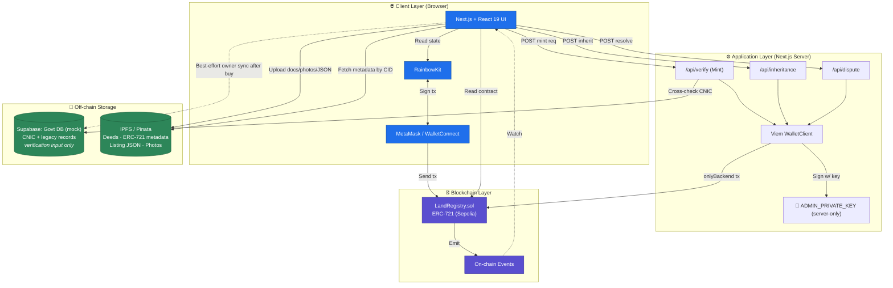
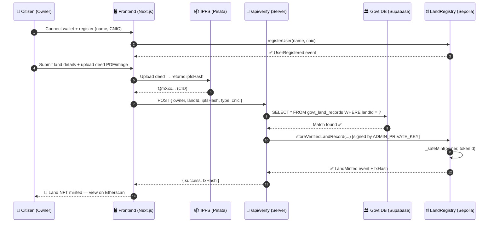
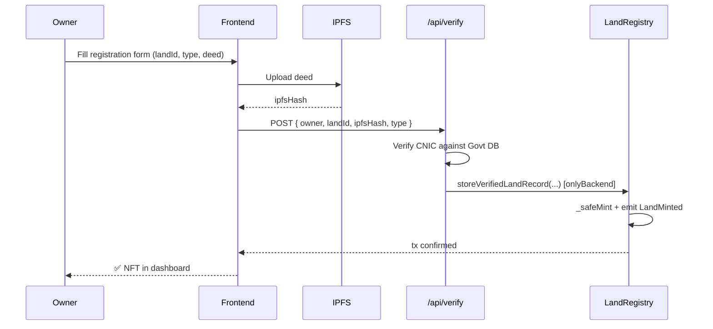
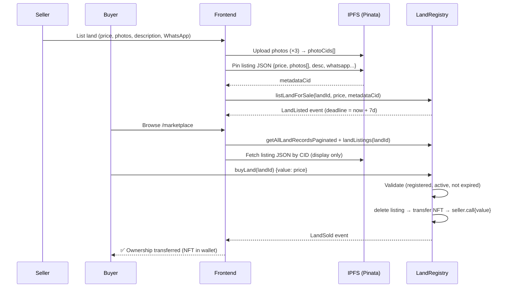
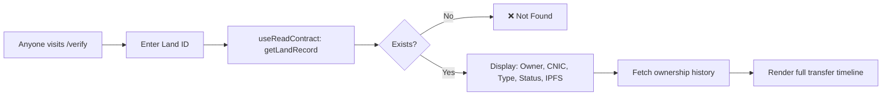
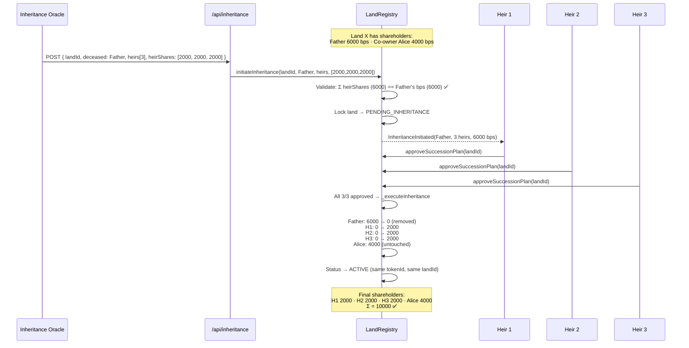
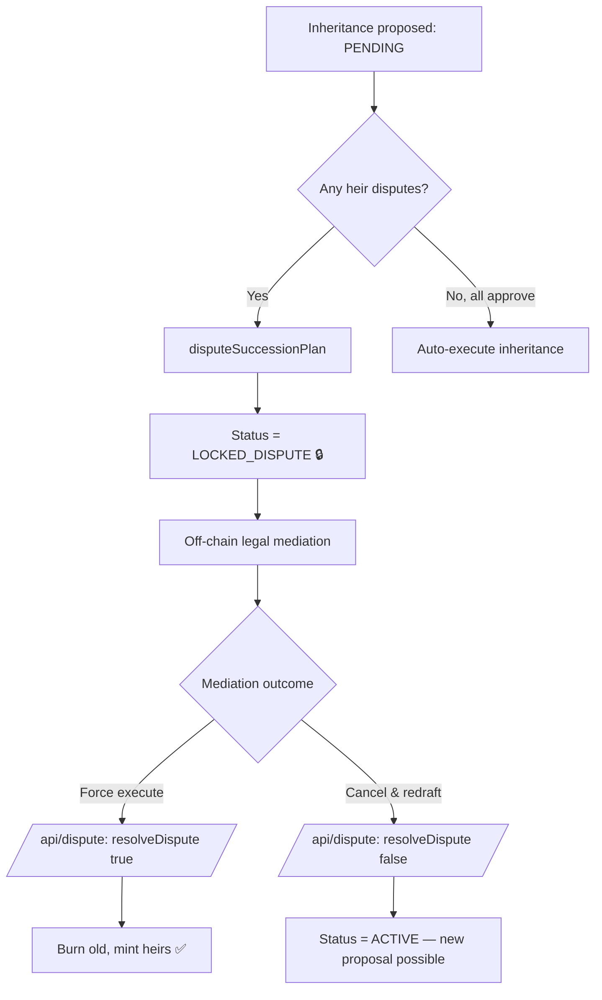
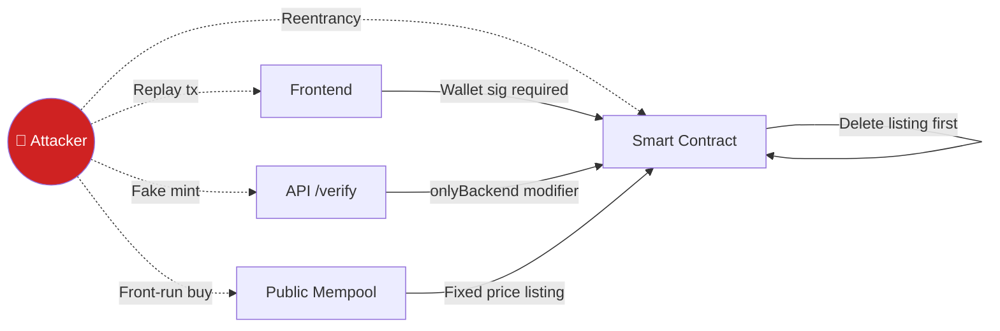

<div align="center">

# 🏛️ LandLedger: A Blockchain-Based Land Registry System

### Tamper-proof, fully decentralized land ownership records on Ethereum + IPFS

> **Fully on-chain marketplace** — listings, prices, photos, and metadata all live on the blockchain or IPFS. **No off-chain database is in the trust path.** A single Supabase instance simulates the legacy government civil registry purely as a verification *input*, not a source of truth.

[](https://soliditylang.org/)
[](https://nextjs.org/)
[](https://react.dev/)
[](https://www.typescriptlang.org/)
[](https://wagmi.sh/)
[](https://viem.sh/)
[](https://www.rainbowkit.com/)
[](https://tailwindcss.com/)
[](https://supabase.com/)
[](https://www.pinata.cloud/)
[](https://sepolia.etherscan.io/)
[](#-license)
[](#)
[](#)

</div>

---

## 📖 Table of Contents

1. [Project Information](#-project-information)
2. [Project Overview](#-project-overview)
3. [Objectives](#-objectives)
4. [Scope & Limitations](#-scope--limitations)
5. [Technology Stack](#-technology-stack)
6. [System Architecture](#-system-architecture)
7. [Methodology](#-methodology)
8. [User Workflows](#-user-workflows)
9. [Smart Contract Design](#-smart-contract-design)
10. [Features](#-features)
11. [Database & Data Models](#-database--data-models)
12. [Installation & Setup](#-installation--setup)
13. [Testing](#-testing)
14. [Security Considerations](#-security-considerations)
15. [Results & Evaluation](#-results--evaluation)
16. [Screenshots & Demo](#-screenshots--demo)
17. [Challenges Faced](#-challenges-faced)
18. [Future Work](#-future-work)
19. [Literature Review](#-literature-review)
20. [Contributors & Acknowledgments](#-contributors--acknowledgments)
21. [License](#-license)
22. [References](#-references)

---

## 📌 Project Information

| Field | Detail |
|-------|--------|
| **Project Title** | LandLedger: A Blockchain-Based Land Registry System |
| **Token / Contract Name** | PakLandRegistry (PLR) — ERC-721 |
| **Project Type** | Final Year Project (FYP) / Undergraduate Thesis |
| **University** | _Institute of Space Technology_ |
| **Department** | _Department of Computer Science_ |
| **Team Members** | _Muhammad Haidar Aziz, Muhammad Riyyan_ |
| **Supervisor** | _[Mr.Haroon Ibrahim, lecturer]_ |
| **Co-Supervisor** | _Ma’am Shakira Musa Baig_ |
| **Submission Year** | 2026 |
| **Project Duration** | 8 months (Sept 2025 — May 2026) |
| **Deployed Network** | Ethereum Sepolia Testnet |
| **Deployed Contract** | [`0xd2a855a8fC38d4E0a871319d5882E696155d1253`](https://sepolia.etherscan.io/address/0xd2a855a8fC38d4E0a871319d5882E696155d1253) — _legacy v3; the **v7 hybrid-governance source** in `contract.sol` requires redeployment before the frontend can use it (see §Smart Contract Design)_ |

---

## 🎯 Project Overview

> **Tagline:** _"Replace the paper allotment letter with an unforgeable on-chain NFT — paperless ownership for new housing societies in Pakistan, from day one."_

### 🌍 Domain
**Blockchain · Real Estate · Housing-Society Allotments · Decentralized Identity · GovTech**

### 🎯 Who This Is For

LandLedger targets **new private and semi-private housing developments in Pakistan** — not the legacy patwari/revenue-office system. Specifically:

- **DHA (Defence Housing Authority)** phases — Lahore, Karachi, Islamabad, Multan, etc.
- **Bahria Town** developments
- **CDA / LDA** auctions for new sectors
- **Private real-estate schemes** launching new societies

These developers operate independently of the patwari system: they issue their own allotment letters, run their own transfer offices, and process their own succession cases. They are paperless-ready from day one — there is no legacy paper trail to migrate, only a fresh allotment to mint as an on-chain NFT.

### 🚨 Problem Statement

New housing societies in Pakistan are administratively independent of the legacy revenue system, but they suffer from their own well-documented fraud patterns. Anyone who has bought or sold a DHA file, a Bahria allotment, or a private-society plot in the last decade has heard of these:

- **🔴 Allotment-letter forgery** — Paper allotment letters are physically altered, duplicated, or fabricated outright.
- **🔴 "DHA file scams"** — Fraudsters sell plot files that are fake, already sold, or never legitimately allotted. Pakistani media regularly reports schemes running into hundreds of millions of rupees.
- **🔴 Double allotment** — Corrupt developer staff issue two valid-looking files for the same plot.
- **🔴 Ghost plots** — A plot exists on paper but not on the ground, or vice versa.
- **🔴 Fake transfer letters** — Forged seller signatures move ownership without the seller's knowledge.
- **🔴 Opaque inheritance** — Succession (*virsa*) cases over inherited plots drag on for years because heirs lack a transparent, tamper-proof process.
- **🔴 No public verification** — A prospective secondary-market buyer cannot independently confirm "is this file real, who actually owns it, has it already been sold?" without going to the developer's transfer office.

### 💡 Why Blockchain?

A developer-controlled database is fundamentally as vulnerable as a paper file: **whoever controls the database controls the truth**, and a bribed staff member can silently edit ownership. Blockchain inverts this:

| Property | Developer DB / Paper File | Blockchain (LandLedger) |
|----------|--------------------------|------------------------|
| **Immutability** | ❌ Records can be silently edited | ✅ Cryptographically tamper-proof |
| **Transparency** | ❌ Internal/closed | ✅ Publicly auditable transaction history |
| **Single Point of Failure** | ❌ One staff member with access = full control | ✅ No single party can rewrite history |
| **Audit Trail** | ❌ Trust the developer's audit log | ✅ Every transfer is a permanent on-chain event |
| **Multi-party Trust** | ❌ Requires the developer as trusted intermediary | ✅ Trustless multi-signature workflows (e.g., inheritance) |
| **Cryptographic Ownership** | ❌ Paper signature / username + password | ✅ Wallet signatures — only the keyholder can transfer |

By encoding allotments as **ERC-721 NFTs**, each plot becomes a unique, non-forgeable digital asset. Allotment letters, site plans, and listing photos are stored on **IPFS** so even the file content is content-addressed and immutable.

### 👥 Target Users

| Role | Use Case |
|------|----------|
| **🧑‍💼 Allottees / Plot Owners** | Register, view, transfer, list-for-sale, and bequeath their plots |
| **🛒 Secondary-Market Buyers** | Verify a file is real and currently owned by the seller before paying |
| **🏛️ Developer (CDA / LDA / DHA / Bahria / Private)** | Whitelisted institutional wallet that allots and issues plot NFTs |
| **👨‍⚖️ Verification Backend (Developer's Transfer Office)** | Cross-checks CNIC against the society's allotment registry before minting |
| **🛡️ Contract Owner / Admin** | Manages developer-authority whitelist; resolves locked disputes |
| **⚖️ Lawyers & Auditors** | Read-only access to immutable transaction history for inheritance / dispute cases |

---

## 🎯 Objectives

1. **Design** a decentralized allotment registry for new housing societies, where each plot is stored as an ERC-721 NFT on Ethereum — eliminating dependence on the developer's centralized database for trust.
2. **Eliminate forged and duplicate allotments** through cryptographic uniqueness — each `landId` deterministically maps to exactly one `tokenId` via `keccak256`.
3. **Implement role-based access control** with four tiers: Contract Owner, Verification Backend (the developer's transfer office), Developer/Government Authorities, and Registered Allottees.
4. **Enable transparent, time-locked secondary-market sales** via an on-chain marketplace with 7-day listing windows and reentrancy-safe ETH settlement.
5. **Build a multi-party inheritance system** that requires 100% heir approval for succession, with a dispute mechanism that locks the plot until resolved.
6. **Provide an immutable audit trail** of every ownership transfer with sale price (for tax transparency and dispute mediation).
7. **Build a buyer-friendly Web3 frontend** that abstracts wallet complexity — hydration-safe SSR, transaction toasts, and IPFS document upload.
8. **Cross-verify identities** against a mock society allotment registry before minting, demonstrating a realistic developer-to-blockchain integration pattern.

---

## 🧭 Scope & Limitations

### ✅ In Scope

- Allottee registration linking wallet ↔ CNIC
- Backend-signed plot allotment minting (Oracle pattern)
- On-chain ownership transfer with sale-price logging
- Secondary-market: list, buy (payable), cancel — with 7-day expiry
- Multi-heir inheritance with approval/dispute voting
- Developer / Government authority whitelist management
- IPFS upload for allotment letters, site plans, and listing photos
- Paginated admin dashboard reading all plot records
- Per-wallet allottee dashboard

### ❌ Out of Scope

- Migration of legacy patwari / revenue-office paper records (a separate, much larger problem)
- Physical surveying or GIS coordinate verification of plot boundaries
- Legal arbitration of disputed cases (handled off-chain by judiciary)
- Mainnet deployment (currently Sepolia testnet only)
- Mobile native applications (web-only interface)
- Tax calculation or payment to revenue authority
- Mortgage / lien / collateral mechanics

### ⚠️ Limitations

- **Gas costs** — Every write transaction requires Sepolia ETH; real-world Pakistan deployment would need a Layer-2 (e.g., Polygon, Arbitrum).
- **Scalability** — Reading all records uses a paginated cursor, but indexing 50M+ Pakistani land parcels would benefit from The Graph or off-chain indexers.
- **Internet dependency** — Citizens in rural areas need internet + a wallet to interact.
- **KYC dependency** — System trusts the verification backend's CNIC check; a malicious backend could mint to wrong owners (mitigated by Govt-only signing key).
- **Pinata API keys** are currently `NEXT_PUBLIC_*` (client-exposed) — production should move uploads to a server route.
- **No private key recovery** — wallet loss = land loss. Future work: account abstraction (ERC-4337) or social recovery.

---

## 🛠️ Technology Stack

### ⛓️ Blockchain Layer

| Tech | Version | Why Chosen |
|------|---------|------------|
| **Ethereum (Sepolia)** | — | Most mature smart-contract platform; Sepolia is the canonical PoS testnet with reliable faucets and free RPC. |
| **Solidity** | `0.8.24` | Pinned (not floating) for reproducible bytecode. Built-in overflow checks, custom errors, transient storage, and `bytes.concat` available. |
| **OpenZeppelin Contracts** | `^5.0` | `ERC721`, `AccessControl`, `Pausable`, `ReentrancyGuard` — battle-tested primitives instead of hand-rolled access control or pause logic. |
| **ERC-721** | — | Each land parcel is a unique non-fungible token (NFT). Perfect semantic fit for unique real-world assets. |

### 🎨 Frontend

| Tech | Version | Why Chosen |
|------|---------|------------|
| **Next.js (App Router)** | `16.1.1` | Server components, file-based routing, built-in API routes for the admin-signing pattern. |
| **React** | `19.2.3` | Latest concurrent features; `useTransition` for smoother on-chain UX. |
| **TypeScript** | `^5` | Type-safe contract interactions; Wagmi infers ABI types automatically. |
| **TailwindCSS** | `^4` | Utility-first styling — rapid iteration without context-switching to CSS files. |
| **Lucide React** | `^0.577` | Clean, consistent icon set. |

### 🔌 Web3 Integration

| Tech | Version | Why Chosen |
|------|---------|------------|
| **Wagmi** | `^2.19` | Type-safe React hooks for contract reads/writes — far ergonomic over raw ethers. |
| **Viem** | `^2.43` | Modern, lightweight, tree-shakable EVM client; used server-side for admin signing. |
| **RainbowKit** | `^2.2` | Best-in-class wallet connection UI — supports MetaMask, WalletConnect, Coinbase, etc. out of the box. |
| **TanStack Query** | `^5.90` | Powers Wagmi's caching layer; handles request dedup and refetching. |

### 💾 Data & Storage

| Tech | Why Chosen |
|------|------------|
| **Supabase (Postgres)** | A **single** hosted PostgreSQL instance — used **only** to simulate the pre-existing government civil registry (CNIC + legacy land records). It is a one-way *input* used by `/api/verify` to confirm citizen identity at mint time; the chain takes over after that. **No marketplace data lives here.** |
| **IPFS via Pinata** | Decentralized, content-addressed storage for **everything off-chain**: land deed documents, ERC-721 metadata JSON, marketplace listing JSON, listing photos. The CID is stored on-chain (in `LandRecord.ipfsHash` and `Listing.metadataHash`), so even off-chain content is tamper-evident. |

### 🔐 Authentication

- **Wallet-based:** Connection + signature via RainbowKit/MetaMask. No passwords, no JWTs.
- **On-chain authorization:** All access checks (`AdminGuard`, registration-required) read from the smart contract — no centralized session.

### 🚀 Deployment

| Layer | Target |
|-------|--------|
| Smart Contract | Sepolia Testnet (deployed at `0xd2a855a8fC38d4E0a871319d5882E696155d1253`) |
| Frontend | Vercel (recommended) — Next.js native host |
| Govt DB (mock) | Supabase Cloud (free tier) — single instance |
| File Storage | Pinata IPFS gateway — documents, photos, all metadata JSON |

### 🧰 Other Tools

`Git` · `GitHub` · `VS Code` · `Postman` (API testing) · `MetaMask` (wallet) · `Sepolia Faucet` (test ETH) · `Etherscan` (transaction inspection) · `Remix IDE` (contract development)

---

## 🏗️ System Architecture

### High-Level Architecture



### Component Breakdown

| Layer | Components | Responsibility |
|-------|-----------|----------------|
| **Presentation** | `app/page.tsx`, `app/dashboard/*`, `app/marketplace/*`, `components/*Modal.tsx` | User interaction, form input, transaction toasts (`TxToast.tsx`), hydration-safe rendering. |
| **Web3 Hooks** | `wagmi`, `viem` via `providers.tsx` | Read contract state, queue transactions, await receipts. |
| **API Routes (Server)** | `app/api/verify`, `app/api/inheritance`, `app/api/dispute` | Hold `ADMIN_PRIVATE_KEY`, sign privileged transactions, cross-check Govt DB. |
| **Authorization Guards** | `components/guards/AdminGuard.tsx` | Read `owner()` from contract, block UI for non-owners. |
| **Data Clients** | `lib/supabase.ts`, `utils/pinata.ts`, `utils/contract.ts` | Encapsulate external clients (single Govt Supabase, Pinata, contract ABI). |
| **Smart Contract** | `contract.sol` (`LandRegistry`) | Source of truth for ownership, marketplace state, inheritance proposals. |

### Data Flow — A Land Registration Request



---

## 📋 Methodology

### Software Development Methodology — **Agile / Scrum**

Chosen because blockchain-frontend integration involves continuous learning and frequent contract redeployment; Waterfall would have locked us into early design mistakes.

- **Sprint length:** 2 weeks
- **Total sprints:** 16 (8 months)
- **Ceremonies:** Sprint planning, daily stand-up (15 min), mid-sprint review, sprint retrospective.

### Sprint Roadmap (high-level)

| Sprints | Focus |
|---------|-------|
| 1–2 | Literature review, requirement gathering, stack selection |
| 3–4 | Smart contract v1 (registration + minting), Hardhat tests |
| 5–6 | Frontend scaffolding (Next.js, RainbowKit, AdminGuard) |
| 7–8 | Govt DB integration, `/api/verify` admin-signing pattern |
| 9–10 | Marketplace contract module + UI (list, buy, cancel) |
| 11–12 | Inheritance module + multi-heir voting + dispute |
| 13 | IPFS migration, Pinata integration |
| 14 | Hydration fixes, transaction toasts, UX polish |
| 15 | Security hardening, contract redeployment, gas profiling |
| 16 | Documentation, demo video, thesis writing |

### Research Methodology

```
Literature Review → Requirement Gathering → System Design →
Implementation → Testing → Evaluation & Comparison → Documentation
```

### Project Management & Version Control

| Concern | Tool / Practice |
|---------|----------------|
| Issue tracking | GitHub Projects |
| Source control | Git + GitHub |
| Branch strategy | Trunk-based with short-lived feature branches (`feat/*`, `fix/*`); merge to `main` via PR |
| CI | GitHub Actions (lint + typecheck) |
| Code review | Pull-request mandatory before merge |
| Communication | WhatsApp + Google Meet (weekly with supervisor) |

---

## 🚦 User Workflows

### 1️⃣ Land Registration (Mint)



### 2️⃣ Marketplace Sale (100% Decentralized — No DB)



> **Note:** No database write happens during listing or purchase. Photos and metadata live on IPFS; price + seller + deadline + metadataCID live on-chain. The govt DB is updated post-purchase only as a best-effort sync to keep the legacy mock in step with reality.

### 3️⃣ Verification (Public)



### 4️⃣ Inheritance — Share Redistribution (v6)



**Key difference vs v5:** the original land NFT (tokenId, IPFS metadata) persists. Heirs become co-shareholders with `Alice` on the same plot — no new NFTs are minted, no subdivision is forced.

### 5️⃣ Dispute Workflow



---

## 📜 Smart Contract Design

### Single Contract: `LandRegistry.sol` — _v7 Hybrid-Governance Architecture_

> **Headline change in v7:** the system is now **explicitly hybrid** — the chain holds land identity and a consensus ledger, while courts, the developer's allotment registry, and the proposed co-owners themselves hold the legal authority. Backend ROLES can only propose; they cannot finalise alone. ALL proposed owners must verify a new import before the NFT mints. Inheritance, subdivision, and import disputes are all resolved by a court-anchored arbiter whose every override is recorded on-chain with a court-order CID.

### 🏛️ Why Hybrid (Not Fully Decentralised)

Pakistani land governance cannot be fully automated on-chain:

| Off-chain dependency | Why on-chain logic alone is insufficient |
|---------------------|------------------------------------------|
| Government / developer registries (NADRA, DHA / Bahria allotment lists) | Ground truth about who exists and who was allotted lives off-chain |
| Inheritance | Islamic / civil family law + probate courts determine who an heir is — a contract cannot |
| Disputes | Title, succession, fraud, and boundary cases require judicial intervention |
| Physical subdivision | Needs surveys, planning approval, and a court order — a contract can record but not authorise the split |

v7 therefore implements **three explicit governance layers**:

1. **Backend ROLES PROPOSE** — `MINTER_ROLE` proposes land imports, `INHERITANCE_ORACLE_ROLE` proposes successions, `SUBDIVISION_ORACLE_ROLE` proposes legal splits. **None of these can finalise unilaterally.**
2. **On-chain stakeholders CONSENT** — proposed owners verify imports, heirs vote on inheritance, current shareholders approve subdivisions. Unanimous consent auto-executes.
3. **Arbiter resolves with court CID** — `DISPUTE_ARBITER_ROLE` can force-execute or cancel a deadlocked proposal, but **only with a court-order CID pinned on IPFS** — every override is publicly auditable.

### 🧭 Eight-State Lifecycle

```
PENDING_VERIFICATION ──┬── all proposed owners verify ────────→ ACTIVE
                       ├── any proposed owner disputes ──────→ LOCKED_IMPORT_DISPUTE
                       │                ├── arbiter force-approve (+ court CID) → ACTIVE
                       │                └── arbiter cancel ───────────────→ (record deleted)
                       ├── minter cancels their own proposal ─→ (record deleted)
                       └── verification deadline elapsed
                           (anyone may call expireLandImport) → (record deleted)

ACTIVE ────┬── initiateInheritance ─────────────→ PENDING_INHERITANCE
           │                                   ├── all heirs approve → ACTIVE (redistributed)
           │                                   └── any dispute → LOCKED_INHERITANCE_DISPUTE
           │                                             ├── arbiter force (+ court) → ACTIVE
           │                                             └── arbiter cancel ───────→ ACTIVE
           │
           └── proposeSubdivision (+ court CID) → PENDING_SUBDIVISION
                                               ├── all shareholders approve → SUBDIVIDED (terminal) + children ACTIVE
                                               └── any dispute → LOCKED_SUBDIVISION_DISPUTE
                                                         ├── arbiter force (+ court) → SUBDIVIDED
                                                         └── arbiter cancel ─────────→ ACTIVE
```

### 🏗️ Two-Layer Architecture

The contract is organised as two **orthogonal** layers. Every state variable and every external function belongs to exactly one of them.

| | **Layer 1 — Land Identity** | **Layer 2 — Ownership Ledger** |
|---|------|------|
| **What it models** | The EXISTENCE of a parcel | The legal owners + their shares |
| **Backing primitive** | ERC-721 NFT (one per parcel for life) | `_shareBps[landId][holder]` mapping |
| **Custody** | Self-custodial (NFT minted to `address(this)`, `_update` rejects external transfers) | n/a — the share ledger is not a transferable token |
| **Created by** | `_finalizeImport` (after every proposed owner verifies) | `_finalizeImport` (initial owners), `transferShare`, `buyShare`, `_executeInheritance` |
| **Destroyed by** | `_executeSubdivision` (parent NFT burned) | `_executeSubdivision` (parent share ledger cleared) |
| **Stable across** | Inheritance, transfers, marketplace sales — **the tokenId never changes** | Subdivision — child lands get fresh ledgers |
| **Key state** | `_landRecords`, `_landExists`, `_tokenIdToLandId`, `_allLandIds` | `_shareholders`, `_shareBps`, `_shareholderIndex`, `_ownerToLands`, `_ownershipHistory`, `_listings`, `_inheritanceRequests`, `_pendingWithdrawals` |
| **Key views** | `tokenURI`, `getLandRecord`, **`getLandIdentity` _(new)_**, `ownerOf` | `getShareholders`, `getShareholdersWithBps`, `getShareBps`, `getTotalShares`, **`getOwnershipSnapshot` _(new)_**, `getOwnershipHistory` |
| **Combined view** | — | — |
| | | `getLandFullView(landId)` returns both layers in a single RPC |

#### Why ERC-721 alone is insufficient for land

| Pain point with plain ERC-721 | LandLedger's answer |
|---|---|
| ERC-721 enforces **one owner per tokenId**. Real parcels routinely have multiple legal co-owners (spouses, siblings, partners). | The NFT is identity only; the share ledger expresses multi-ownership natively. |
| Inheritance creates new owners **without** physical subdivision. ERC-721 has no way to redistribute while keeping the tokenId stable. | `initiateInheritance` is purely layer-2 — tokenId is invariant. |
| **Partial sales** (sell 30% of a plot) require minting fractional NFTs or wrappers, which destroy identity continuity. | `buyShare(landId, seller, maxPrice)` adjusts only bps. The plot stays one NFT. |
| "Who legally owns this parcel?" is a list with shares in most jurisdictions, not a single address. | `getOwnershipSnapshot` returns the list + shares + total in one call. |

#### Why ownership redistribution differs from subdivision

| Operation | Layer | What changes | What does NOT change |
|---|---|---|---|
| `transferShare`, `buyShare`, inheritance | **Layer 2 only** | `_shareBps` entries for the involved holders; ownership history appended | tokenId, IPFS metadata, NFT custody, total share count (still 10,000) |
| `proposeSubdivision` → `_executeSubdivision` | **Layer 1** | Parent NFT burned + status `SUBDIVIDED` (terminal); N new tokenIds minted with fresh ledgers; **court-order CID required at propose** | None — this is the only operation that creates new land NFTs after import |

The distinction matters because in the real world, "this parcel changed hands" and "this parcel was physically split" are completely different legal events. Conflating them produces wrong on-chain records.

### ⚖️ Hybrid Inheritance Workflow (v7+)

Inheritance is the workflow where the hybrid governance model matters most. **The contract deliberately does NOT calculate shares.** Pakistani succession law is layered (Muslim Family Laws Ordinance 1961, Succession Act 1925 for non-Muslims, plus customary law applied by family courts) and depends on facts a contract cannot know (religion of the deceased, family tree, the validity of any will, disclaimers, etc.). Encoding one interpretation into bytecode would be both legally inappropriate and technically fragile.

Instead, courts compute shares off-chain; the contract enforces the court's decision.

**Four-phase flow:**

```
1. APPEAL        Heir / lawyer calls fileInheritanceAppeal(landId,
   (on-chain)    deceasedHolder, courtOrderCid).
                 → Returns appealId. Public-record event.
                 → Does NOT change land status.

2. OFF-CHAIN     Backend reads InheritanceAppealFiled event, verifies
   VERIFICATION  the court order's legal authenticity (signatures,
                 jurisdiction, judge identity, registry stamps).
                 → If invalid, backend ignores it. The appeal lives
                   on-chain forever as "filed but not actioned".
                 → If valid, backend prepares the heirs[] + heirShares[]
                   arrays per the court order.

3. PROPOSAL      Backend calls initiateInheritance(landId, deceased,
   (on-chain)    heirs[], heirShares[], courtOrderCid, appealId).
                 → Status becomes PENDING_INHERITANCE.
                 → sharesHash = keccak256(heirs, shares, courtOrderCid)
                   is locked into the proposal. Cannot be silently
                   edited.
                 → 30-day votingDeadline starts.
                 → Linked appeal marked isProcessed = true.

4. CONSENSUS     Each heir calls approveSuccessionPlan OR
   (on-chain)    disputeSuccessionPlan. Heirs can only approve/dispute;
                 they cannot edit percentages.
                 → All approve → auto-execute (deceased's bps → heirs).
                 → Any dispute → status LOCKED_INHERITANCE_DISPUTE.
                   Arbiter resolves with a fresh court-order CID.
                 → Deadline elapses → expireInheritance resets to ACTIVE.
```

### Two-Tier Dispute Resolution (v8)

Pure unanimous-consent inheritance is operationally fragile — a single inactive or malicious heir can permanently freeze a parcel. v8 splits resolution into two tiers:

```
TIER 1 — VOLUNTARY CONSENSUS
  All heirs approve within INHERITANCE_VOTING_DURATION (30d) → auto-execute.
  No override needed; no arbiter involvement; no IPFS evidence required
  beyond the original court order CID committed in the proposal.

TIER 2 — LEGAL OVERRIDE  (escalation path)
  Triggered when:
    a) any heir calls disputeSuccessionPlan, OR
    b) the arbiter calls freezeInheritanceForReview(landId, reason).

  Status moves to LOCKED_INHERITANCE_DISPUTE. To resolve, the arbiter
  MUST commit FOUR audit anchors in a single call to
  resolveInheritanceDispute(landId, forceExecute,
                            updatedCourtOrderCid,
                            legalResolutionCid,
                            overrideReason):

    • updated court order CID    — re-authorises the share split, possibly
                                   amended from the original
    • legal resolution CID       — the judgment / order that adjudicates
                                   the dispute itself
    • human-readable reason      — committed on-chain (boundedString)
    • resolver address + ts      — captured automatically

  Each override appends an immutable row to _legalOverrides[landId];
  query history via getLegalOverrides / getLegalOverride /
  totalLegalOverrides. Cancellation (forceExecute=false) requires the
  same metadata so cancellations are equally auditable.
```

**Why this hybrid is necessary:**

| Failure mode of pure on-chain consensus | How tier-2 fixes it |
|---|---|
| One inactive heir freezes the parcel forever | Arbiter can resolve with a court order specifying the absent heir's share |
| Single-heir holdout extortion | Holdout's veto can be overridden via the legal route |
| Heir-rejection cycle (everyone votes no) | After deadline, anyone may `expireInheritance` to reset — backend re-proposes |
| Arbitrary arbiter power | Override requires updated court CID + legal resolution CID + written reason + resolver identity, all logged immutably |
| Hidden override decisions | Every override (force OR cancel) emits `LegalOverrideExecuted` with full payload |

**Why this design is secure:**

| Concern | Mitigation |
|---|---|
| Backend secretly finalises | Cannot — `_executeInheritance` only runs when every named heir has approved (or the arbiter force-resolves with a court CID, which itself is an audit-logged event). |
| Backend silently swaps heir shares under the same court order | Detectable — `sharesHash = keccak256(heirs, shares, courtCid)` is committed at proposal time. Auditors call `computeSharesHash` off-chain and compare. |
| Heirs collude to rewrite the split | Impossible — heirs have no edit primitive; they can only `approve` or `dispute`. A dispute forces the case back into court. |
| Replay attacks across re-proposed plans | Vote state is keyed by `(landId, proposalNonce, heir)`. Every re-proposal bumps the nonce → fresh slots, stale votes inert. |
| Stuck proposal (one heir disappears) | Auto-expires after `INHERITANCE_VOTING_DURATION = 30 days`. Anyone may call `expireInheritance` to reset. |
| Hardcoded religious law | None — the contract has no notion of Muslim/non-Muslim split. It enforces whatever the court ordered, period. |
| One-NFT-per-heir subdivision | Forbidden — inheritance is layer-2 only. The tokenId is invariant. Heirs become co-shareholders of the same parcel. If they want physical division, that's a separate court-anchored `proposeSubdivision`. |

### 🏘️ Legal Land Subdivision System (v8)

Subdivision is the **only** operation in the contract that creates new land NFTs after import. It models the real-world legal act of splitting one parcel into N new ones — which is fundamentally different from co-ownership.

#### Co-ownership vs. physical subdivision

| | **Co-ownership** _(layer 2)_ | **Physical subdivision** _(layer 1)_ |
|---|---|---|
| What is it | Multiple addresses hold bps of ONE parcel | The parcel becomes TWO+ distinct parcels on the ground |
| NFT effect | None — same tokenId, same identity | Parent NFT burned, child NFTs minted |
| Authorisation | Voluntary trades / inheritance / market sales | Court order **+** survey document, both pinned on IPFS |
| Reversibility | Trivial (share trades back) | Requires re-merger — a separate legal process |
| Required role | Shareholders themselves | `SUBDIVISION_ORACLE_ROLE` proposes; current shareholders approve |
| Examples | Three siblings co-own a 1-kanal plot; one sells her 20% | A 1-kanal plot is surveyed and split into a 0.6-kanal house plot and a 0.4-kanal commercial frontage |

#### Why inheritance should NOT fragment land automatically

When a holder dies leaving three children, the children typically become **co-owners** of one parcel (layer-2 redistribution). Forcing the parcel to physically split would:

- require a survey + planning approval the contract cannot authorise,
- produce three plots that may be too small to be legally useful or marketable,
- break NFT identity continuity (provenance trackers, liens, indexers all lose their anchor),
- impose physical division on heirs who might prefer to sell the whole parcel jointly or continue using it together.

Inheritance therefore lives in layer 2; subdivision is a separate, deliberate, court-anchored layer-1 act.

#### Why subdivision requires two legal-verification artefacts

| Artefact | What it answers | Field |
|---|---|---|
| **Court order CID** | "May we do this?" — the legal authority for the split | `SubdivisionPlan.courtOrderCid` |
| **Survey metadata CID** | "What exactly are the new parcels?" — boundaries, area, surveyor identity, new plot IDs | `SubdivisionPlan.surveyMetadataCid` |

Both are required at `proposeSubdivision` and immutable thereafter. The on-chain record commits to BOTH the legal authority and the technical specification.

#### Parent ↔ child lineage tracking

Every child carries a pointer back to its parent; every parent carries the list of children it produced.

| State | Purpose |
|---|---|
| `_parentOfLand[childId]` | direct parent (empty for top-level imports) |
| `_childrenOfLand[parentId]` | array of immediate children |
| `_subdivisionGeneration[landId]` | how many splits upstream (0 = import) |

View functions:

- `getParentLand(landId)` — direct parent
- `getChildLands(landId)` — direct children
- `getSubdivisionGeneration(landId)` — generation index
- `getSubdivisionLineage(landId)` — full ancestry array from oldest down to `landId` (for title-chain due diligence)

#### Tier-2 dispute resolution (matches v8 inheritance)

`resolveSubdivisionDispute` now requires the same four audit anchors as the inheritance equivalent: `updatedCourtOrderCid`, `legalResolutionCid`, `overrideReason`, plus the auto-captured resolver/timestamp. Every override appends an immutable row to `_subdivisionLegalOverrides[parentLandId]`. `freezeSubdivisionForReview` lets the arbiter escalate independent of shareholder action.

### 🛒 Fractional-Ownership Marketplace (v8)

The marketplace trades **ownership shares**, not NFTs. Every operation is layer-2: the basis-point ledger updates while the ERC-721 NFT stays put. The contract enforces this distinction at the type level — there's no `transferFrom` path that moves a land NFT between addresses.

#### Why share trading differs from NFT transfer

| | Share trade | NFT transfer |
|---|---|---|
| What moves | basis-point entries in `_shareBps[landId]` | the NFT itself |
| tokenId change | None | New tokenId on burn+remint paths |
| Multiple sellers per parcel | Yes — one listing per `(landId, seller)` | No — single owner per tokenId |
| Settles | Synchronously inside `buyShare` | Via `_safeTransfer` |
| Effect on `ownerOf(tokenId)` | None — still returns `address(this)` | Changes |
| Effect on tokenURI / IPFS metadata | None | None |
| Used here | `transferShare`, `buyShare`, inheritance | **Never** (NFTs are self-custodial and `_update` rejects external transfers) |

A buyer who acquires 30% of a five-owner plot becomes the sixth co-shareholder of the same parcel. The land remains one physical plot, with one tokenId, in the contract's custody.

#### Why pull payments improve security

| | Push (`buyShare` → `seller.call{value: price}`) | Pull (v6+ — current) |
|---|---|---|
| Malicious-seller grief | Seller's reverting `receive()` makes EVERY buyer's `buyShare` revert — one-line griefing of the listing | Seller's `receive()` is never called inside `buyShare`; payment is a pure SSTORE to `_pendingWithdrawals[seller]` |
| Reentrancy attack surface | Inside `buyShare` (external call to seller) | Inside `withdrawProceeds` only, which zeroes balance first (CEI) and is `nonReentrant` |
| Failure-domain isolation | A bad seller breaks the whole listing flow | A bad seller only breaks their own withdrawal — buyer's purchase still settles |
| Admin abuse surface | None on this axis | `_totalPendingWithdrawals` accounting blocks `emergencyWithdraw` from sweeping seller escrow |

The trade-off: sellers pay a second tx to claim. Worth it.

#### Marketplace history

Every settled `buyShare` appends one row to `_marketplaceHistory[landId]` (in addition to the broader `_ownershipHistory`). The filtered log makes secondary-market analytics — total volume per parcel, average price per bps, time-on-market — a single RPC call.

| State | Purpose |
|---|---|
| `_listings[landId][seller]` | Active listings, one per (landId, seller) pair |
| `_marketplaceHistory[landId]` | Append-only log of settled trades |
| `_pendingWithdrawals[address]` | Pull-payment ledger |
| `_totalPendingWithdrawals` | Accounting cap protecting escrow from `emergencyWithdraw` |

Views: `getMarketplaceHistory(landId)`, `getMarketplaceTrade(landId, index)`, `totalMarketplaceTrades(landId)`.

### 🏠 Occupancy / Use-right System (v8)

Occupancy is a **separate ledger** from ownership. Granting a tenancy or use-right does not move shares; revoking it does not affect the share ledger. The contract stores pointers to off-chain legal agreements — it makes no attempt to algorithmically assign which physical portion of the parcel anyone occupies.

#### Ownership vs occupancy vs subdivision

| | **Ownership** _(layer 2)_ | **Occupancy** _(separate ledger)_ | **Subdivision** _(layer 1)_ |
|---|---|---|---|
| What it records | bps of legal rights | Time-bounded right of use | Creation of new physical parcels |
| Touches share ledger? | Yes | **No** | No (but clears parent's ledger on burn) |
| Mints / burns NFTs? | No | **No** | Yes (burns parent, mints children) |
| Authorised by | Owners themselves | Any single shareholder | Court order + survey doc + unanimous shareholders |
| Reversible | Trade back | Revoke or expire | Requires re-merger |
| Example | Two heirs own 50% each | One occupies upper floor under a lease until 2027 | One plot becomes two surveyed plots with new title docs |

#### Example (why all three exist)

> Two siblings each **OWN** 50% of a house. By private agreement, the elder **OCCUPIES** the upper floor under a residential lease; the younger **OCCUPIES** the lower floor under a separate lease. Both leases run for 5 years.

This is three on-chain records:

- `_shareBps[landId][elder] = 5000`, `_shareBps[landId][younger] = 5000` (ownership)
- `OccupancyAgreement` { grantor: younger, occupant: elder, category: RESIDENTIAL_LEASE, termsCid: "Qm...upper" }
- `OccupancyAgreement` { grantor: elder, occupant: younger, category: RESIDENTIAL_LEASE, termsCid: "Qm...lower" }

The house is still **one parcel with one NFT**. No subdivision occurred. If the heirs later want two physically distinct plots, they file `proposeSubdivision` with a court order + survey document — that's the separate workflow.

#### Why physical-allocation logic stays off-chain

"Who occupies which physical portion" depends on physical reality (which floor, which corner, which acres), mutual agreement, lease/licence terms, and local zoning. None of these can be captured exhaustively in on-chain data. The contract stores **pointers** — `termsCid` (mandatory) and `descriptionCid` (optional) — to the human-readable legal documents on IPFS. The on-chain ledger is the **audit trail** (who granted what to whom, and when), not the substantive agreement.

#### Frontend rendering hints

Each agreement carries an `OccupancyCategory` enum value — UIs use it to render labels like "Tenant: 0xabc… (residential lease until 2027-05-09)" or "Farmer-of-record: 0xdef… (agricultural lease until 2026-03-15)". Use `getActiveOccupancyAgreements(landId)` to filter only the currently-in-force agreements; the full history (including revoked / expired) is still available via `getOccupancyAgreements(landId)`.

### 🛡️ Consolidated Security Audit (v5 → v8 trail)

A full enumeration of every previous vulnerability class and the property now defending against it lives in the contract preamble (`CONSOLIDATED SECURITY AUDIT`). Twenty rows, each with a `PREV → NOW` pair. Headline coverage:

| Defence layer | Mechanism |
|---|---|
| Reentrancy | `nonReentrant` on every state-mutating external touching NFTs or ETH |
| Pause / emergency halt | `Pausable`; withdrawals intentionally exempt |
| Access control | Six AccessControl roles, each independently grantable / revocable |
| Push-payment grief | Pull-payment escrow + `_totalPendingWithdrawals` accounting |
| CEI ordering | Strict throughout — listings deleted before transfer; balance zeroed before sendValue |
| Replay across re-issued proposals | Vote state keyed on `(landId, proposalNonce, addr)` |
| Duplicate / DoS in batches | All inputs pre-validated at proposal time |
| Unauthorised state transitions | Explicit 8-state enum; status changes always emit |
| Dispute deadlock | Tier-2 legal override with four-anchor audit metadata |
| Stuck proposals | `expireLandImport`, `expireInheritance` — anyone callable after deadline |
| Unauthorised backend finalisation | Import is two-phase; inheritance proposals are immutable; subdivision needs unanimous consent + court CID + survey CID |
| Hidden share rewrites | `sharesHash = keccak256(heirs, shares, courtCid)` committed at propose time |
| Admin draining escrow | `emergencyWithdraw` capped at `balance - escrow` |
| Gas griefing via huge strings | `MAX_STRING_LENGTH = 256` enforced by `boundedString` |
| Stale listings | `buyShare` re-verifies seller's current bps |
| Front-running on price | `maxPrice` parameter + decrease-only price updates |
| External-call safety | `Address.sendValue` everywhere |
| Transparency | Comprehensive events on every state change |
| Auditability | Append-only audit logs for marketplace, inheritance overrides, subdivision overrides |
| Backend trust assumptions | Every backend action is either a proposal needing consent or an override committed to court / legal CIDs |

### 🧮 The Fractional Ownership Model (carried from v6)

### 🧮 The Fractional Ownership Model

#### Why this redesign

The legacy v1–v5 model assumed **one land = one owner**, and handled inheritance by **burning the original NFT and minting a new NFT per heir**. That's conceptually wrong for three reasons:

| # | Why "one land = one owner" was flawed | What v6 does instead |
|---|---------------------------------------|----------------------|
| 1 | **Inheritance does not physically divide land.** When an allottee dies leaving three children, those children most commonly become **co-owners** of the same plot — they do not receive three new physically distinct plots. | Heirs replace the deceased in the share ledger of the same land. No subdivision unless explicitly chosen later. |
| 2 | **NFT identity continuity was lost.** Burning the original tokenId and assigning new IDs breaks any external system that anchored on it (provenance trackers, lien holders, indexers). | Same `tokenId` and `landId` persist from mint forever. Heirs just appear in the share ledger. |
| 3 | **No way to sell a partial share.** A holder of a 100% plot who wanted to sell 30% had no on-chain expression. | `listShareForSale(landId, shareBpsForSale, …)` and `buyShare(landId, seller, maxPrice)` are first-class. |

#### Why basis points (10,000 = 100%)

Solidity has no native fractional/decimal type. We use **uint16 basis points** (max 65,535, comfortably fits 10,000) because:

- 0.01% resolution — enough for any realistic split.
- All-integer math — no rounding pitfalls.
- Industry standard — every DeFi share/fee contract uses bps; auditors recognise the pattern immediately.
- 16 bits per shareholder is much cheaper than uint256 percentages in storage and calldata.

#### Invariants (hold for every ACTIVE land)

| | Invariant |
|---|-----------|
| **I1** | Σ `_shareBps[landId][h]` over all shareholders == **`TOTAL_SHARES = 10000`** |
| **I2** | `_shareBps[landId][h] > 0` **⇔** `h` is in `_shareholders[landId]` |
| **I3** | `_shareholders[landId]` contains no duplicates |
| **I4** | `_shareholders[landId].length ≤ MAX_SHAREHOLDERS = 100` |
| **I5** | Every `h ∈ _shareholders[landId]` is an authorised holder (registered citizen OR `GOVT_AUTHORITY_ROLE`) |

These are preserved by construction in `_increaseShare` / `_decreaseShare`, and re-asserted by every share-mutating operation. `getTotalShares(landId)` returns the runtime sum so it can be checked externally.

#### NFT custody model

Every land NFT is minted to `address(this)` (self-custodial) and **can never leave**. The `_update` override rejects every post-mint transition. ERC-721's `ownerOf(tokenId)` therefore returns the contract address itself; **meaningful ownership lives in the basis-point share ledger**, not in `ownerOf`. This trades external-marketplace visibility (OpenSea would see the contract as holder) for a coherent multi-owner model — appropriate for a closed governance-grade registry.

---

### Single Contract: `LandRegistry.sol` — _v6 Layer Stack_

The system intentionally consolidates all logic into a single contract to minimize cross-contract calls and gas overhead. Modules are organized via section comments and follow the canonical Solidity layout order (errors → types → state → events → modifiers → constructor → external → internal → views).

**v5 inherits from four OpenZeppelin primitives:**

| Inherited | Why |
|-----------|-----|
| `ERC721` | Land NFT semantics |
| `AccessControl` | Rotatable role-based permissions with **role separation** (see matrix below) |
| `Pausable` | Emergency pause on every user-facing write — **pull-payment withdrawals stay open during pause** so funds are never trapped |
| `ReentrancyGuard` | Applied to **every state-mutating path that touches NFT transfers or ETH** — not just `buyLand` |

**v5 Headline Security Upgrades (over v4):**

| # | Improvement | What it prevents |
|---|------------|------------------|
| 1 | **Pull-payment escrow** for sale proceeds | A malicious seller's reverting `receive()` can no longer grief buyers — the seller pulls funds via `withdrawProceeds()` |
| 2 | **Role separation** — `BACKEND_ROLE` split into `MINTER_ROLE`, `INHERITANCE_ORACLE_ROLE`, `DISPUTE_ARBITER_ROLE` | Compromise of one off-chain key no longer exposes mint + inheritance + dispute powers simultaneously |
| 3 | **`maxPrice` parameter on `buyLand`** | Seller-side front-running — buyer fails closed if listing price moved between sign and confirm |
| 4 | **Decrease-only `updateListingPrice`** | Seller cannot silently raise price; raising requires `cancelListing` + `listLandForSale` (visibly resets clock) |
| 5 | **`nonReentrant` on every NFT-mutating path** | `onERC721Received` reentrancy via malicious recipient contracts (mint, transfer, marketplace, inheritance) |
| 6 | **String length cap (`MAX_STRING_LENGTH = 256`)** on all inputs | Gas griefing via giant strings pinned into storage |
| 7 | **Heir ≠ current owner check** at `initiate` | Self-inheritance bypass / sanity guard |
| 8 | **`_totalPendingWithdrawals` accounting** | `emergencyWithdraw` can sweep ONLY stray ETH — never user balances, even if admin is malicious |
| 9 | **Withdrawals NOT gated by pause** | Pause halts new ops without trapping seller earnings |
| 10 | **`Address.sendValue`** for all outgoing ETH | OZ-standardised reverting-on-failure; cleaner than manual `.call` |

| Module | Purpose |
|--------|---------|
| **Identity** | `registerUser`, `getUser`, `cnicToAddress` |
| **Land Import** _(v7 — multi-party verification)_ | `proposeLandImport`, `verifyLandImport`, `disputeLandImport`, `cancelLandImport`, `expireLandImport`, `resolveLandImportDispute`, `getImportProposal`, `isImportVerified`, `getPendingVerifiers`, `getVerificationStatus` |
| **Land Data** | `getLandRecord`, `_landExists`, `tokenURI` (NFT minted only at import finalisation) |
| **NFT (ERC-721)** | OpenZeppelin `ERC721`; deterministic `tokenId = keccak256(landId)`; **self-custodial** — `_update` override allows only mint + burn (subdivision) |
| **Share Ledger** | `transferShare`, `getShareholders`, `getShareholdersWithBps`, `getShareBps`, `getTotalShares` |
| **Marketplace** _(per-share, per-seller; v8 marketplace history)_ | `listShareForSale`, `updateListingPrice` _(decrease-only)_, `buyShare(landId, seller, maxPrice)`, `cancelListing`, `getListing(landId, seller)`, `getMarketplaceHistory`, `getMarketplaceTrade`, `totalMarketplaceTrades` |
| **Escrow** | `withdrawProceeds`, `pendingProceeds`, `totalPendingWithdrawals` — pull-payment ledger |
| **Inheritance** _(heir-appeal → oracle-proposal → vote → execute; redistributes shares, never mints)_ | `fileInheritanceAppeal` _(new)_, `initiateInheritance(.., courtOrderCid, appealId)`, `approveSuccessionPlan`, `disputeSuccessionPlan`, `expireInheritance` _(new)_, `resolveInheritanceDispute`, `getInheritanceRequest`, `getInheritanceAppeal`, `getInheritanceAppealsForLand`, `hasHeirApproved`, `computeSharesHash` _(pure helper)_ |
| **Legal Subdivision** _(v7)_ | `proposeSubdivision`, `approveSubdivision`, `disputeSubdivision`, `resolveSubdivisionDispute`, `getSubdivisionPlan`, `getSubdivisionPart`, `hasShareholderApprovedSubdivision` |
| **Occupancy / Use-right** _(v8 — category + optional metadata)_ | `grantOccupancy(.., category, .., termsCid, descriptionCid)`, `revokeOccupancy`, `getOccupancyAgreements`, `getActiveOccupancyAgreements` _(new — filters by time + revocation)_, `getOccupancyAgreement` |
| **Indexing** | `_allLandIds`, `_ownerToLands`, `getAllLandRecordsPaginated`, `getLandsByOwner`, `getLandsByCnic`, `totalLandRecords` |
| **Access Control** _(v9 governance model)_ | `ADMIN_ROLE` _(alias of `DEFAULT_ADMIN_ROLE`)_, `REGISTRAR_ROLE` _(unified backend proposer — import + inheritance + subdivision)_, `RESOLVER_ROLE` _(court-anchored dispute resolver)_, `PAUSER_ROLE` _(emergency halt)_, `GOVT_AUTHORITY_ROLE` _(institutional holder status — NOT a backend role)_ |
| **Lifecycle** | `pause`, `unpause`, `emergencyWithdraw` _(stray-ETH only)_, `setGovtAuthority` |
| **History** | `OwnershipChange[]` log per land — one entry per shareholder change (mint, transfer, sale, inheritance leg, subdivision seed) |

### Key Functions

| Function | Caller | Modifier(s) | Description |
|----------|--------|-------------|-------------|
| `registerUser(name, cnic)` | Citizen | `whenNotPaused`, `boundedString` | One-time wallet ↔ CNIC binding |
| **`proposeLandImport(landId, ipfsHash, lType, proposedOwners[], proposedShares[], courtOrderCid)`** | Registrar | `onlyRole(REGISTRAR_ROLE)`, `whenNotPaused`, `boundedString` | Files an import for all-owner verification; NFT NOT minted yet; shares must sum to 10,000; verification window of `VERIFICATION_DURATION` (90 days) starts now |
| **`verifyLandImport(landId)`** | Proposed owner | `whenNotPaused`, `nonReentrant` | Records caller's verification (immutable, scoped to `proposalNonce`); when ALL proposed owners verify within the deadline, NFT mints + ledger populates atomically |
| **`disputeLandImport(landId)`** | Proposed owner | `whenNotPaused` | Locks the import (→ `LOCKED_IMPORT_DISPUTE`) — freezes the deadline; arbiter resolution required |
| **`cancelLandImport(landId)`** | Registrar | `onlyRole(REGISTRAR_ROLE)`, `whenNotPaused` | Cancels caller's own pending proposal |
| **`expireLandImport(landId)`** _(new — v7 verification refinement)_ | Anyone | `whenNotPaused` | After the verification deadline has elapsed, deletes the import shell so the landId is freed for re-import. Public utility — no role required |
| **`resolveLandImportDispute(landId, forceApprove, courtOrderCid)`** | Resolver | `onlyRole(RESOLVER_ROLE)`, `whenNotPaused`, `nonReentrant`, `boundedString` | Force-approve (with court CID) or cancel |
| `transferShare(landId, recipient, shareBps, price)` | Shareholder | `whenNotPaused`, `nonReentrant`, `landMustExist`, `onlyActive` | Transfer a bps portion of caller's share |
| `listShareForSale(landId, shareBpsForSale, price, metaHash)` | Shareholder | `whenNotPaused`, `landMustExist`, `onlyActive`, `boundedString` | List a bps portion for sale (7-day deadline) |
| `updateListingPrice(landId, newPrice)` | Seller | `whenNotPaused` | **Decrease only** on caller's own listing |
| `buyShare(landId, seller, maxPrice)` | Registered or Govt-Authority Buyer | `whenNotPaused`, `nonReentrant`, `landMustExist`, `onlyActive`, `payable` | Atomic purchase of `seller`'s listed share; refunds excess; credits seller via escrow |
| `withdrawProceeds()` | Any seller with balance | `nonReentrant` _(NOT whenNotPaused)_ | Pull-payment claim of accumulated sale proceeds |
| `cancelListing(landId)` | Seller | `whenNotPaused` | Removes caller's listing |
| **`fileInheritanceAppeal(landId, deceasedHolder, courtOrderCid)`** _(new — heir-initiated)_ | Any registered citizen | `whenNotPaused`, `boundedString`, `landMustExist`, `onlyActive` | Public-record appeal that an inheritance is in progress, citing the court-order CID. Returns `appealId`. Does NOT change land status — the oracle decides off-chain whether to act. |
| `initiateInheritance(landId, deceasedHolder, heirs[], heirShares[], **courtOrderCid**, **appealId**)` _(v7+ signature)_ | Registrar | `onlyRole(REGISTRAR_ROLE)`, `whenNotPaused`, `boundedString`, `landMustExist`, `onlyActive` | Files an IMMUTABLE proposal. `courtOrderCid` is now REQUIRED at proposal time and committed into `sharesHash = keccak256(abi.encode(heirs, heirShares, courtOrderCid))`. 30-day `votingDeadline` set. |
| `approveSuccessionPlan(landId)` | Heir | `whenNotPaused`, `nonReentrant` | Vote yes; reverts after `votingDeadline`; auto-executes at 100% |
| `disputeSuccessionPlan(landId)` | Heir | `whenNotPaused` | Locks → `LOCKED_INHERITANCE_DISPUTE` (freezes the deadline) |
| **`expireInheritance(landId)`** _(new — public utility)_ | Anyone | `whenNotPaused` | After `votingDeadline` elapses, resets status to `ACTIVE` so the oracle can re-propose. proposalNonce preserved → fresh vote slots on the next proposal. |
| **`freezeInheritanceForReview(landId, reason)`** _(new — tier-2 escalation)_ | Resolver | `onlyRole(RESOLVER_ROLE)`, `whenNotPaused`, `boundedString` | Transitions `PENDING_INHERITANCE` → `LOCKED_INHERITANCE_DISPUTE` for formal legal review even without an heir dispute. Reason logged via `InheritanceFrozenForReview`. |
| **`resolveInheritanceDispute(landId, forceExecute, updatedCourtOrderCid, legalResolutionCid, overrideReason)`** _(v8 — full audit metadata required)_ | Resolver | `onlyRole(RESOLVER_ROLE)`, `whenNotPaused`, `nonReentrant`, `boundedString` × 3 | Force-execute (with updated court CID) OR cancel. Both paths append an immutable row to `_legalOverrides[landId]` and emit `LegalOverrideExecuted` with the full payload (resolver, timestamp, both CIDs, reason). |
| **`resolveInheritanceDispute(landId, force, courtOrderCid)`** _(v7 — renamed + court CID)_ | Resolver | `onlyRole(RESOLVER_ROLE)`, `whenNotPaused`, `nonReentrant`, `boundedString` | Force-execute (with court CID) or cancel |
| **`proposeSubdivision(parentLandId, SubdivisionProposalInput)`** _(v9 — struct param to avoid stack-too-deep without Via IR)_ | Registrar | `onlyRole(REGISTRAR_ROLE)`, `whenNotPaused`, `landMustExist`, `onlyActive` (CID length checks inlined) | Files a legal-subdivision plan. The `SubdivisionProposalInput` struct bundles `{ newLandIds[], newIpfsHashes[], newLandShareholders[][], newLandShares[][], courtOrderCid, surveyMetadataCid }`. **Both** the court order (legal authority) AND the survey metadata (technical specification) must be IPFS-pinned. Each child land's shares must sum to 10,000. |
| **`approveSubdivision(parentLandId)`** | Parent shareholder | `whenNotPaused`, `nonReentrant` | Vote yes; auto-executes when ALL current shareholders approve |
| **`disputeSubdivision(parentLandId)`** | Parent shareholder | `whenNotPaused` | Locks → `LOCKED_SUBDIVISION_DISPUTE` |
| **`freezeSubdivisionForReview(parentLandId, reason)`** _(new — tier-2 escalation)_ | Resolver | `onlyRole(RESOLVER_ROLE)`, `whenNotPaused`, `boundedString` | Lock for formal legal review without an heir/shareholder dispute |
| **`resolveSubdivisionDispute(parentLandId, force, updatedCourtOrderCid, legalResolutionCid, overrideReason)`** _(v8 — full audit metadata)_ | Resolver | `onlyRole(RESOLVER_ROLE)`, `whenNotPaused`, `nonReentrant`, `boundedString` × 3 | Force-execute OR cancel. Both paths append an immutable row to `_subdivisionLegalOverrides[parentLandId]`. |
| **`grantOccupancy(landId, category, occupant, startTime, endTime, termsCid, descriptionCid)`** _(v8 — category enum + optional metadata)_ | Shareholder | `whenNotPaused`, `landMustExist`, `onlyActive`, `boundedString` | Record a time-bound right of use. `category` ∈ {RESIDENTIAL_LEASE, AGRICULTURAL_LEASE, COMMERCIAL_LEASE, USE_RIGHT, OTHER}. `descriptionCid` may be empty. Does NOT affect the share ledger. |
| **`revokeOccupancy(landId, agreementId)`** | Original grantor | `whenNotPaused` | Marks the agreement revoked |
| `setGovtAuthority(wallet, status)` | Admin | `onlyRole(ADMIN_ROLE)` | Grant/revoke `GOVT_AUTHORITY_ROLE` |
| `pause()` / `unpause()` | Pauser | `onlyRole(PAUSER_ROLE)` | Halts/resumes user-facing writes |
| `emergencyWithdraw(to)` | Admin | `onlyRole(ADMIN_ROLE)`, `nonReentrant` | Sweeps **stray ETH only** (never seller escrow) |
| `getLandRecord(landId)` | Anyone | view | Public verification (no `currentOwner`/`cnic` field — use share views) |
| **`getLandIdentity(landId)`** _(new — layer-1 projection)_ | Anyone | view | Returns `LandIdentity` view-struct: pure identity (landId, ipfsHash, type, status, timestamps) + derived `tokenId` |
| **`getOwnershipSnapshot(landId)`** _(new — layer-2 projection)_ | Anyone | view | Returns `OwnershipSnapshot` view-struct: shareholders[] + shares[] + total + count, one RPC |
| **`getLandFullView(landId)`** _(new — both layers combined)_ | Anyone | view | Returns `(LandIdentity, OwnershipSnapshot)` together for the land-detail page |
| `getShareholders(landId)` / `getShareholdersWithBps(landId)` | Anyone | view | Shareholder enumeration |
| `getShareBps(landId, holder)` / `getTotalShares(landId)` | Anyone | view | Per-holder + runtime-sum bps views |
| `getListing(landId, seller)` | Anyone | view | Listing for a (land, seller) pair |
| `getOwnershipHistory(landId)` | Anyone | view | Full append-only audit log (every shareholder change, all sources) |
| **`getMarketplaceHistory(landId)`** _(new — v8)_ | Anyone | view | Filtered log of MARKET-PRICED trades only (settled `buyShare` calls) |
| **`getMarketplaceTrade(landId, index)`** / **`totalMarketplaceTrades(landId)`** _(new)_ | Anyone | view | One trade by index + total count for analytics |
| `getInheritanceRequest(landId)` | Anyone | view | Full proposal (deceased, heirs, shares, courtOrderCid, appealId, sharesHash, votingDeadline) |
| **`getLegalOverrides(landId)`** _(new — tier-2 audit)_ | Anyone | view | Append-only history of every arbiter override against this land |
| **`getLegalOverride(landId, i)`** / **`totalLegalOverrides(landId)`** _(new)_ | Anyone | view | One row by index + total count |
| `getImportProposal(landId)` | Anyone | view | Full import details (proposer, owners, shares, deadline, courtCid, nonce) |
| `isImportVerified(landId, owner)` | Anyone | view | Whether `owner` has verified the current proposal |
| `getPendingVerifiers(landId)` _(new)_ | Anyone | view | Subset of proposed owners who still haven't verified |
| `getVerificationStatus(landId)` _(new)_ | Anyone | view | Aggregated `(status, verified, total, deadline, isExpired)` for the verification panel |
| `getSubdivisionPlan(landId)` / `getSubdivisionPart(landId, i)` | Anyone | view | Subdivision plan (incl. surveyMetadataCid) + per-child allocations |
| **`getParentLand(landId)`** / **`getChildLands(landId)`** / **`getSubdivisionGeneration(landId)`** / **`getSubdivisionLineage(landId)`** _(v8)_ | Anyone | view | Parent-child relationships and full ancestry walk for title-chain due diligence |
| **`getSubdivisionLegalOverrides(parentLandId)`** / **`getSubdivisionLegalOverride(parentLandId, i)`** / **`totalSubdivisionLegalOverrides(parentLandId)`** _(v8)_ | Anyone | view | Tier-2 audit log for subdivision overrides |
| `getOccupancyAgreements(landId)` _(v7)_ | Anyone | view | All occupancy agreements (incl. revoked) |
| `getAllLandRecordsPaginated(cursor, size)` | Anyone | view | Cursor-based admin pagination |
| `pendingProceeds(account)` / `totalPendingWithdrawals()` | Anyone | view | Pull-payment balances |

### Events Emitted

```solidity
event UserRegistered(address indexed user, string name, string cnic);

// Land import (v7) -------------------------------------------------------------
event LandImportProposed(string indexed landId, address indexed proposer, uint256 ownerCount, string courtOrderCid, uint256 proposalNonce, uint64 verificationDeadline);
event LandImportVerified(string indexed landId, address indexed owner, uint256 proposalNonce, uint256 verificationCount, uint256 ownersTotal);
event LandImportDisputed(string indexed landId, address indexed disputer, uint256 proposalNonce);
event LandImportCancelled(string indexed landId);
event LandImportExpired(string indexed landId, uint256 proposalNonce, uint64 deadline);
event LandImportResolved(string indexed landId, bool forceApproved, string courtOrderCid);
event LandImportFinalized(string indexed landId, uint256 proposalNonce);

// NFT mint — emitted at IMPORT FINALISATION, not at proposal -------------------
event LandMinted(string indexed landId, LandType lType, uint256 tokenId);

// Share-ledger -----------------------------------------------------------------
event ShareholderAdded(string indexed landId, address indexed holder, uint16 shareBps);
event ShareholderRemoved(string indexed landId, address indexed holder);
event ShareTransferred(string indexed landId, address indexed from, address indexed to, uint16 shareBps, uint256 price);

// Marketplace (per-share, per-seller) ------------------------------------------
event ShareListed(string indexed landId, address indexed seller, uint16 shareBpsForSale, uint256 price, string metadataHash);
event ListingPriceUpdated(string indexed landId, address indexed seller, uint256 oldPrice, uint256 newPrice);
event ListingCancelled(string indexed landId, address indexed seller);
event ShareSold(string indexed landId, address indexed buyer, address indexed seller, uint16 shareBps, uint256 price);

// Pull-payment -----------------------------------------------------------------
event ProceedsCredited(address indexed seller, uint256 amount);
event ProceedsWithdrawn(address indexed seller, uint256 amount);

// Inheritance ------------------------------------------------------------------
event InheritanceInitiated(string indexed landId, address indexed deceasedHolder, uint256 totalHeirs, uint16 deceasedShareBps, uint256 proposalNonce);
event HeirApproved(string indexed landId, address indexed heir, uint256 proposalNonce);
event InheritanceDisputed(string indexed landId, address indexed heir, uint256 proposalNonce);
event InheritanceFinalized(string indexed landId, uint256 proposalNonce);

// Tier-2 dispute resolution (v8) ----------------------------------------------
event InheritanceFrozenForReview(string indexed landId, address indexed resolver, string reason, uint64 timestamp);
event LegalOverrideExecuted(string indexed landId, address indexed resolver, uint256 overrideIndex, bool forceExecuted, string updatedCourtOrderCid, string legalResolutionCid, string overrideReason, uint64 timestamp);
// (Replaces v7's InheritanceDisputeResolved — the new event carries the full audit payload.)

// Legal subdivision (v7) -------------------------------------------------------
event SubdivisionProposed(string indexed parentLandId, uint256 newLandCount, string courtOrderCid, uint256 proposalNonce);
event SubdivisionApproved(string indexed parentLandId, address indexed shareholder, uint256 proposalNonce);
event SubdivisionDisputed(string indexed parentLandId, address indexed shareholder, uint256 proposalNonce);
event SubdivisionFinalized(string indexed parentLandId, uint256 newLandCount, uint256 proposalNonce);
event SubdivisionDisputeResolved(string indexed parentLandId, bool forceExecuted, string courtOrderCid);

// Occupancy / use-right (v7) ---------------------------------------------------
event OccupancyGranted(string indexed landId, uint64 indexed agreementId, address indexed grantor, address occupant, uint64 startTime, uint64 endTime, string termsCid);
event OccupancyRevoked(string indexed landId, uint64 indexed agreementId, address indexed grantor);

// Other ------------------------------------------------------------------------
event LandStatusChanged(string indexed landId, LandStatus status);
event EmergencyWithdrawal(address indexed to, uint256 amount);
// AccessControl emits RoleGranted / RoleRevoked / RoleAdminChanged.
// Pausable emits Paused / Unpaused.
```

> **Event-name migration in v7:** `DisputeResolved` → `InheritanceDisputeResolved`. `LandMinted` no longer carries an `initialOwner` (the import flow produces multiple owners at once — listen for `ShareholderAdded` for each).

### Custom Errors

v4 replaces every `require` string with a typed custom error (saves ~50 gas per revert and gives callers a machine-parseable failure mode). Examples:

```solidity
error LandRegistry__NotAuthorizedHolder(address account);
error LandRegistry__LandAlreadyExists(string landId);
error LandRegistry__LandNotActive(string landId);
error LandRegistry__InsufficientPayment(uint256 sent, uint256 required);
error LandRegistry__DuplicateHeir(address heir);
error LandRegistry__DuplicateNewLandId(string landId);
// ...full list in contract.sol
```

### Access Control Matrix (v9 — consolidated governance)

| Role | Propose Import | Verify Import | Transfer | List / Buy | Initiate Inheritance | Propose Subdivision | Resolve Dispute | Set Govt Auth | Pause |
|------|:---:|:---:|:---:|:---:|:---:|:---:|:---:|:---:|:---:|
| `ADMIN_ROLE` _(= `DEFAULT_ADMIN_ROLE`)_ | ❌ | (own share only) | ✅ | ✅ | ❌ | ❌ | ❌ | ✅ | ❌ |
| `REGISTRAR_ROLE` _(unified backend proposer)_ | ✅ | (own share only) | ❌ | ❌ | ✅ | ✅ | ❌ | ❌ | ❌ |
| `RESOLVER_ROLE` _(court-anchored)_ | ❌ | (own share only) | ❌ | ❌ | ❌ | ❌ | ✅ (+ court CID + legal CID + reason required) | ❌ | ❌ |
| `PAUSER_ROLE` | ❌ | ❌ | ❌ | ❌ | ❌ | ❌ | ❌ | ❌ | ✅ |
| `GOVT_AUTHORITY_ROLE` _(institutional holder — not a backend role)_ | ❌ | (own share only) | ✅ (own share) | ✅ (buy + sell) | ❌ | ❌ | ❌ | ❌ | ❌ |
| Registered Citizen | ❌ | ✅ (own proposal only) | ✅ (own share) | ✅ | ❌ | ❌ | ❌ | ❌ | ❌ |
| Unregistered Wallet | ❌ | ❌ | ❌ | ❌ | ❌ | ❌ | ❌ | ❌ | ❌ |

> **Why hybrid governance exists.** Pakistani land governance cannot be fully automated (ground truth in govt registries; heirship decided by family courts; disputes need judicial intervention) and cannot be fully off-chain either (paper records are forgeable; trusted-operator failure produces real-world DHA / Bahria file scams). v9 makes the hybrid explicit: `REGISTRAR_ROLE` proposes, on-chain stakeholders consent (unanimous → execute), `RESOLVER_ROLE` overrides only with court / legal CIDs pinned on IPFS.

> **Why role separation improves trust.** The boundaries above each close a specific failure mode:
> - **REGISTRAR ↔ stakeholder consent**: a leaked REGISTRAR key can spam-create proposals but cannot mint, redistribute, or split land without affected-party approval.
> - **REGISTRAR ↔ RESOLVER**: the actor who proposes is not the actor who resolves. A compromised REGISTRAR cannot also force-execute its own disputed proposal.
> - **PAUSER ↔ ADMIN**: halting operations is operationally distinct from managing role membership.
> - **ADMIN as multisig**: a single-key admin can re-grant every role to themselves and defeat the rotations above — production deployments MUST hold `ADMIN_ROLE` in a multisig.
> - **GOVT_AUTHORITY_ROLE is not a backend role**: it's a holder status. Compromising a GOVT_AUTHORITY wallet behaves exactly like compromising any other holder — it can move its own share but cannot affect anyone else's.

> **All roles are independently grantable/revocable.** The constructor grants both `REGISTRAR_ROLE` and `RESOLVER_ROLE` to the `backend` argument for bootstrap convenience; production deployments should revoke `RESOLVER_ROLE` from the backend and assign it to a separate court-anchored operator wallet.

### Lifecycle State Machine

```
                ┌──────────────────────────┐
                ▼                          │
┌──────────┐         initiateInheritance   │
│  ACTIVE  │ ──────────────────────────────┤
└─────┬────┘                               │
      │                                    ▼
      │                       ┌────────────────────────┐
      │     all heirs approve │  PENDING_INHERITANCE   │
      │     ┌─────────────────┤                        │
      │     │                 └──────────┬─────────────┘
      ▼     ▼                            │ any heir
┌──────────────┐                         │ disputes
│  INHERITED   │  ◄──── force-execute    ▼
│  (terminal)  │  ◄──┐         ┌─────────────────┐
└──────────────┘     └─────────┤ LOCKED_DISPUTE  │
                               └─────────┬───────┘
                                         │ resolveDispute(false)
                                         ▼
                                       ACTIVE (loop back)
```

### Gas Optimization Techniques

1. **Pinned `solc 0.8.24`** with reproducible bytecode + custom errors throughout (saves ~50 gas/revert).
2. **Manual `tokenId ↔ landId` mapping** instead of `ERC721URIStorage` — skips per-token string storage.
3. **Deterministic `tokenId = keccak256(landId)`** — no counter SSTORE on mint.
4. **`uint64` timestamps + deadlines** — packed into shared slots with adjacent fields.
5. **Swap-and-pop** in `_removeFromOwnerList` — O(1) removal vs. O(n) array shift.
6. **CEI ordering**: `delete listing` *before* ETH send; storage refunds reclaim gas.
7. **O(1) heir-membership lookup** via `_isHeirFor[landId][nonce][addr]` — replaces the original's per-vote linear scan.
8. **Cursor-based pagination** instead of returning the full `allLandIds[]` array — bounds gas per query.
9. **`unchecked { ++i; }`** loop counters where overflow is impossible (post-`MAX_HEIRS=50` validation).
10. **Custom `enum`s** for status/type — packed into a single storage slot.

### Bugs Fixed in v4 (vs. legacy v3 contract on Sepolia)

| # | Legacy bug | v4 fix |
|---|------------|--------|
| 1 | `buyLand` accepted `msg.value >= price` but never refunded the excess — overpayments were trapped in the contract forever | Refunds `msg.value - price` to the buyer at the end of `buyLand`; added `emergencyWithdraw` as a safety net |
| 2 | `_executeInheritance` burned the old NFT but never called `_removeFromOwnerList(oldOwner, oldLandId)` — `getLandsByCnic(deceased)` kept returning the dead landId | Old owner's index is cleaned up; old land is marked `INHERITED` so it's distinguishable from active land |
| 3 | After `resolveDispute(force=false)`, the `hasApproved` mapping from the previous round persisted — heirs who voted on the bad plan were permanently blocked from voting on the corrected one | `proposalNonce` is bumped on every `initiateInheritance`; all vote/membership state is scoped to that nonce |
| 4 | Duplicate addresses in `heirs[]` deadlocked the proposal (an address can only vote once but contributes 2 to `heirs.length`) | Duplicate heirs are rejected at `initiateInheritance` |
| 5 | If any `newLandIds[i]` collided with an existing land, the *final voter's* tx reverted — the proposal could never reach execution | All collisions are pre-validated at initiate time |
| 6 | `verificationBackend` was `immutable` — a leaked key bricked the contract | `BACKEND_ROLE` is rotatable via `AccessControl` |
| 7 | `transferLandOwnership` left active listings stale — a buyer could send ETH to the *previous* seller while the *current* owner lost the NFT | `_update` override auto-clears any active listing on every NFT move (transfer or burn) |
| 8 | Govt-authority wallets couldn't buy via the marketplace (only registered citizens could) | `buyLand` accepts any `_isAuthorizedHolder` (citizen or govt) |
| 9 | No way to adjust listing price without cancelling + relisting (which reset the 7-day clock) | New `updateListingPrice` keeps the deadline |
| 10 | No reentrancy guard, no pause mechanism, no emergency withdraw | `nonReentrant` on `buyLand`, `Pausable` on every user write, `emergencyWithdraw` for stuck ETH |
| 11 | `setGovtAuthority` emitted no event — indexers couldn't observe whitelist changes | `AccessControl` natively emits `RoleGranted` / `RoleRevoked` |

---

## ✨ Features

| # | Feature | Description | User Role |
|---|---------|-------------|-----------|
| 1 | **Wallet-based Sign-in** | Connect via MetaMask / WalletConnect / Coinbase using RainbowKit | All |
| 2 | **User Registration (KYC)** | Bind wallet to legal CNIC with on-chain uniqueness checks | Citizen |
| 3 | **Land NFT Minting** | Government-signed mint after CNIC + record cross-check | Backend / Govt |
| 4 | **Document Upload (IPFS)** | Deed images/PDFs uploaded to Pinata; CID stored on-chain | Citizen / Admin |
| 5 | **Direct Ownership Transfer** | Peer-to-peer transfer with sale-price log for tax transparency | Owner |
| 6 | **Marketplace Listing** | List land with price + photos; auto-expires after 7 days | Owner |
| 7 | **Atomic Purchase** | Send ETH → receive NFT in one transaction; reentrancy-safe | Buyer |
| 8 | **Listing Cancellation** | Owner can withdraw listing anytime before sale | Owner |
| 9 | **Multi-Heir Inheritance** | Backend proposes split; requires 100% heir approval | Backend / Heirs |
| 10 | **Dispute Locking** | Any heir can dispute → land freezes until admin resolves | Heirs |
| 11 | **Public Verification** | Anyone can look up `landId` and view full ownership history | Public |
| 12 | **Govt Authority Whitelist** | Owner can grant institutional wallets (CDA/DHA) the right to hold land without CNIC | Contract Owner |
| 13 | **Admin Dashboard** | Paginated table of all lands, status filters, mint console | Contract Owner |
| 14 | **User Dashboard** | View owned lands, pending inheritance votes, active listings | Citizen |
| 15 | **Transaction Toasts** | Real-time on-screen feedback for every blockchain tx | All |
| 16 | **Hydration-Safe SSR** | No SSR/client mismatch flicker on wallet-aware pages | All |
| 17 | **Search & Filter** | Filter marketplace by land type, area, location | All |
| 18 | **Audit Trail Viewer** | Per-land timeline of every owner change with timestamp + price | All |

---

## 💾 Database & Data Models

### Entity-Relationship Diagram

```mermaid
erDiagram
    USER_PROFILE ||--o{ LAND_RECORD : owns
    LAND_RECORD ||--|| LISTING : "may have"
    LAND_RECORD ||--o{ OWNERSHIP_HISTORY : logs
    LAND_RECORD ||--o| INHERITANCE_REQUEST : "may be subject to"
    INHERITANCE_REQUEST ||--o{ HEIR : includes
    LAND_RECORD ||--|| IPFS_METADATA : "ipfsHash → CID"
    LISTING ||--|| IPFS_LISTING_JSON : "metadataHash → CID"
    GOVT_LAND_RECORD ||--|| LAND_RECORD : "mock → verified at mint"
    GOVT_CITIZEN ||--|| USER_PROFILE : "mock → verified at mint"

    USER_PROFILE {
        address wallet PK
        string name
        string cnic UK
        bool isRegistered
    }
    LAND_RECORD {
        string landId PK
        address currentOwner FK
        string cnic
        string ipfsHash
        enum landType
        enum status
        uint256 verifiedAt
    }
    LISTING {
        string landId PK_FK
        uint256 price
        address seller
        bool isActive
        uint256 deadline
        string metadataHash
    }
    OWNERSHIP_HISTORY {
        string landId FK
        address owner
        uint256 timestamp
        uint256 price
    }
    INHERITANCE_REQUEST {
        string oldLandId PK_FK
        address[] heirs
        string[] newLandIds
        string[] newIpfsHashes
        uint256 approvalCount
        bool isExecuted
    }
    GOVT_LAND_RECORD {
        string land_id PK
        string owner_cnic
        string location
        int area_sq_yards
        string land_type
        string ipfs_hash
    }
    GOVT_CITIZEN {
        string cnic PK
        string full_name
    }
    IPFS_METADATA {
        string CID PK
        string name
        string image
        json attributes
        json documents
    }
    IPFS_LISTING_JSON {
        string CID PK
        string description
        string location
        int area_sq_yards
        string land_type
        float price_eth
        string whatsapp_contact
        text[] photos
    }
```

### On-Chain Data (Source of Truth)

```solidity
enum LandType   { RESIDENTIAL, AGRICULTURAL, COMMERCIAL }
enum LandStatus {
    PENDING_VERIFICATION,           // import filed; awaiting all-owner verify within VERIFICATION_DURATION
    ACTIVE,                         // operational
    PENDING_INHERITANCE,
    PENDING_SUBDIVISION,
    LOCKED_IMPORT_DISPUTE,
    LOCKED_INHERITANCE_DISPUTE,
    LOCKED_SUBDIVISION_DISPUTE,
    SUBDIVIDED                      // terminal — children carry the value
}

// Land identity. proposedAt + verifiedAt anchor the import lifecycle on-chain.
struct LandRecord         { string landId; string ipfsHash; LandType landType; LandStatus status; uint64 proposedAt; uint64 verifiedAt; }

struct UserProfile        { string name; string cnic; bool isRegistered; }

// Pre-mint import — NFT and share ledger are NOT yet created.
// verificationDeadline = proposedAt + VERIFICATION_DURATION (90 days).
struct ImportProposal     { address proposer; address[] proposedOwners; uint16[] proposedShares; uint256 verificationCount; string courtOrderCid; uint256 proposalNonce; uint64 verificationDeadline; bool isCancelled; }

struct Listing            { uint16 shareBpsForSale; uint256 price; address seller; bool isActive; uint64 deadline; string metadataHash; }

struct OwnershipChange    { address from; address to; uint16 shareBps; uint64 timestamp; uint256 price; }

// Inheritance — courtOrderCid populated only when an arbiter force-resolves.
struct InheritanceRequest { address deceasedHolder; address[] heirs; uint16[] heirShares; uint256 approvalCount; bool isExecuted; uint256 proposalNonce; string courtOrderCid; }

// Subdivision — court CID REQUIRED at proposal (physical-division authority).
//   Per-new-land shareholder/share allocations live in separate mappings keyed by
//   (parentLandId, proposalNonce, newLandIndex) to keep the struct small.
struct SubdivisionPlan    { string[] newLandIds; string[] newIpfsHashes; string courtOrderCid; uint256 approvalCount; bool isExecuted; uint256 proposalNonce; }

// Occupancy — time-bound right of use; SEPARATE from the share ledger.
struct OccupancyAgreement { uint64 id; address grantor; address occupant; uint64 startTime; uint64 endTime; string termsCid; bool isRevoked; }

// --- Share ledger -------------------------------------------------------------
//   mapping(string => address[])                    _shareholders
//   mapping(string => mapping(address => uint16))   _shareBps
//   mapping(string => mapping(address => uint256))  _shareholderIndex
//
// Invariants (held by construction for every ACTIVE land):
//   I1: Σ _shareBps[landId][h] == 10000
//   I2: _shareBps[landId][h] > 0 ⇔ h ∈ _shareholders[landId]
//   I3: no duplicates in _shareholders
//   I4: _shareholders.length ≤ MAX_SHAREHOLDERS (100)
//   I5: every holder is authorised (registered citizen or GOVT_AUTHORITY_ROLE)
```

### Off-Chain Data (Single Govt Supabase — *mock*)

| Table | Key Columns | Role |
|-------|-------------|------|
| `govt_land_records` | `land_id`, `owner_cnic`, `location`, `area_sq_yards`, `land_type`, `ipfs_hash` | Mock of pre-existing govt land registry. `ipfs_hash` holds the ERC-721 metadata CID after digitization. After purchase, `owner_cnic` is updated as a best-effort sync. |
| `govt_citizens` | `cnic`, `full_name` | Mock CNIC database. Cross-checked by `/api/verify` before mint. |

> **Note:** there is **no marketplace database**. Marketplace listings (price, seller, deadline, metadataCID) live entirely on-chain in `landListings[landId]`. Listing photos and JSON metadata live entirely on IPFS via Pinata. The earlier dual-Supabase architecture has been replaced by a fully decentralized stack.

### On-chain vs Off-chain Trade-off

| Data | Stored Where | Reason |
|------|--------------|--------|
| Ownership (`currentOwner`) | ⛓️ On-chain | Must be tamper-proof — the legal claim itself |
| Sale price history | ⛓️ On-chain | Tax transparency; must be auditable |
| Land status (Active/Locked/Pending) | ⛓️ On-chain | Drives transfer rules; must be enforced |
| CNIC ↔ wallet mapping | ⛓️ On-chain | Required for transfer-recipient validation |
| Deed images / PDFs | 📦 IPFS | Too large + expensive on-chain; CID on-chain proves integrity |
| Marketplace photos array | 📦 IPFS + Supabase | Fast queries via DB; immutable image source via IPFS |
| Listing description, WhatsApp | 🗄️ Supabase | Mutable presentation data; not legally binding |
| Govt civil records | 🗄️ Supabase (mock) | Simulates pre-existing government infrastructure |

---

## 🎨 UI / Design System

The frontend follows a small, consistent design language so every page feels like part of the same product:

| Convention | Defined in | When to use |
|------------|-----------|-------------|
| `bg-brand-dark` (`#0a0b1e`) | `globals.css` | Every page background — no ad-hoc dark variants |
| `.glass-card` | `globals.css` | Modal panels and floating dialog cards |
| `.surface` / `.surface-hover` | `globals.css` | Subtle dashboard tiles, info cards, list rows |
| `.btn-primary` / `.btn-secondary` / `.btn-ghost` | `globals.css` | Default button hierarchy |
| `.field` | `globals.css` | Standard text inputs |
| `.pill` | `globals.css` | Status / role chips (paired with a tone color) |
| Indigo-600 | brand primary | Primary CTA color across the app |
| Inline notice banners | each page | Replaces native `alert()` — never use `alert()` in user-facing flows |
| `home-stagger` | `app/page.tsx` only | Fade-up cascade for hero/portals; **not** used on dashboards or marketplace |

**Single canonical navbar.** `src/components/Navbar.tsx` is the only navigation component — it uses Next.js `<Link>`, has an active-link state via `usePathname()`, and includes a mobile hamburger drawer. The legacy `Header.tsx` was removed in the UI polish iteration.

**Footer.** Reads `CONTRACT_ADDRESS` from `utils/contract.ts` and links directly to the deployed contract on Sepolia Etherscan.

---

## 🚀 Installation & Setup

### Prerequisites

| Requirement | Version | Purpose |
|-------------|---------|---------|
| **Node.js** | `≥ 18.x` (20+ recommended) | Run Next.js dev server |
| **npm** | `≥ 9.x` | Package management (or yarn/pnpm) |
| **MetaMask** | Latest | Browser wallet extension |
| **Sepolia ETH** | At least `0.05` | Get from [sepoliafaucet.com](https://sepoliafaucet.com/) |
| **Git** | Latest | Clone & version control |

### Step 1 — Clone the Repository

```bash
git clone https://github.com/HaiderAziz428/Blockchain-based-Land-Record-System.git
cd Blockchain-based-Land-Record-System
```

### Step 2 — Install Dependencies

```bash
npm install
```

### Step 3 — Configure Environment Variables

Create a `.env.local` file in the project root:

```env
# WalletConnect (RainbowKit)
NEXT_PUBLIC_WALLETCONNECT_PROJECT_ID=your_project_id

# Government Mock Database (single Supabase instance)
NEXT_PUBLIC_SUPABASE_URL=https://xxx.supabase.co
NEXT_PUBLIC_SUPABASE_PUBLISHABLE_DEFAULT_KEY=your_anon_key

# Pinata IPFS — handles documents, photos, ERC-721 metadata, listing JSON
NEXT_PUBLIC_PINATA_API_KEY=your_pinata_key
NEXT_PUBLIC_PINATA_API_SECRET=your_pinata_secret

# 🔐 Server-only — never prefix with NEXT_PUBLIC_
ADMIN_PRIVATE_KEY=0xYOUR_ADMIN_WALLET_PRIVATE_KEY
```

> 🗑️ **Removed in v3:** `NEXT_PUBLIC_MARKET_URL` and `NEXT_PUBLIC_MARKET_KEY` are no longer needed — the marketplace is now fully on-chain + IPFS.

> ⚠️ **Security:** `ADMIN_PRIVATE_KEY` belongs to the wallet set as `verificationBackend` during contract deployment. Never commit it. Never expose it to the client.

### Step 4 — Re-Deploy the Smart Contract (required for v7)

> ⚠️ **The Sepolia contract at `0xd2a855a8fC38d4E0a871319d5882E696155d1253` is the legacy v3 source.** The v7 hybrid-governance source in `contract.sol` has a fundamentally different ABI — `storeVerifiedLandRecord` is replaced by the two-phase `proposeLandImport` + `verifyLandImport` flow; new functions for legal subdivision (`proposeSubdivision`, `approveSubdivision`, `disputeSubdivision`, `resolveSubdivisionDispute`) and occupancy (`grantOccupancy`, `revokeOccupancy`); `resolveDispute` renamed to `resolveInheritanceDispute` and now takes a `courtOrderCid` argument. Plus all v5/v6 changes (fractional-ownership share ledger, role separation, pull payment, custom errors). Redeployment is mandatory.

```bash
# In Remix IDE or your Hardhat / Foundry project:
# 1. Install OZ contracts:        npm i @openzeppelin/contracts@^5
# 2. Compile contract.sol with    solc 0.8.24 (pinned)
# 3. Deploy with constructor arg: backend = <wallet that will sign /api/* calls>
#                                 The deployer becomes ADMIN_ROLE + PAUSER_ROLE.
#                                 `backend` initially gets REGISTRAR_ROLE +
#                                 RESOLVER_ROLE (v9 consolidated). Production
#                                 deploys should revoke RESOLVER_ROLE from the
#                                 backend so the same key cannot both propose
#                                 AND override.
# 4. Post-deploy hardening tasks (recommended order):
#    a. Transfer DEFAULT_ADMIN_ROLE to a multisig (Gnosis Safe) — single-key
#       admin defeats role separation.
#    b. grantRole(PAUSER_ROLE, <ops wallet>)
#    c. setGovtAuthority(<dev/inst wallet>, true)  for each institutional holder.
#    d. (Strongly recommended) split the backend roles:
#       - Keep REGISTRAR_ROLE on the proposing daemon's key.
#       - revokeRole(RESOLVER_ROLE, backend) and grantRole(RESOLVER_ROLE,
#         <separate court-anchored operator>) so the same key cannot both
#         propose AND override.
# 5. Update CONTRACT_ADDRESS in src/utils/contract.ts
# 6. Regenerate the ABI in src/utils/contract.ts from the new artifact
# 7. Frontend changes needed for v7:
#    - Import flow is now TWO-PHASE:
#      a. Backend calls proposeLandImport(landId, ipfsHash, lType,
#         proposedOwners[], proposedShares[], courtOrderCid). NFT is
#         NOT minted; status = PROPOSED.
#      b. Each proposed owner connects their wallet and calls
#         verifyLandImport(landId). The dashboard should show pending
#         imports for the connected wallet (filter via the
#         LandImportProposed event's proposedOwners[]). NFT mints
#         automatically when the last owner verifies.
#      c. Owners can dispute via disputeLandImport(landId).
#      d. Arbiter resolves via resolveLandImportDispute(landId, force,
#         courtOrderCid).
#    - Share / marketplace API stays the same as v6:
#      transferShare, listShareForSale, buyShare(landId, seller, maxPrice),
#      cancelListing, updateListingPrice, withdrawProceeds.
#    - Inheritance unchanged from v6 except resolveDispute is renamed
#      resolveInheritanceDispute(landId, force, courtOrderCid) — pass the
#      court order CID when force=true.
#    - Legal subdivision is a NEW workflow:
#      proposeSubdivision(parentLandId, newLandIds[], newIpfsHashes[],
#        newLandShareholders[][], newLandShares[][], courtOrderCid).
#      Each parent shareholder calls approveSubdivision(parentLandId);
#      auto-executes at unanimous. Dispute path mirrors inheritance.
#    - Occupancy is a NEW concept SEPARATE from ownership:
#      grantOccupancy(landId, occupant, startTime, endTime, termsCid).
#      Render as "Current tenant: X (until DD-MM-YYYY)" in the land detail
#      view. The shareholder list is unchanged when occupancy changes.
#    - LandStatus has 8 states now (vs 3 in v6). Render distinct UI for
#      PROPOSED (yellow — "awaiting verification by N owners"),
#      PENDING_INHERITANCE / PENDING_SUBDIVISION (blue — "vote pending"),
#      LOCKED_* (red — "arbiter resolution needed"),
#      SUBDIVIDED (grey — "this land has been subdivided into <children>").
```

### Step 5 — Run the Dev Server

```bash
npm run dev
```

Open [http://localhost:3000](http://localhost:3000).

### Step 6 — Connect MetaMask to Sepolia

1. Open MetaMask → Network dropdown → **Add Network** → Show test networks → Select **Sepolia**.
2. Get test ETH from [sepoliafaucet.com](https://sepoliafaucet.com/) or [google cloud faucet](https://cloud.google.com/application/web3/faucet/ethereum/sepolia).
3. Click **Connect Wallet** in the LandLedger UI.

### NPM Scripts

```bash
npm run dev       # Start Next.js dev server (Turbopack)
npm run build     # Production build
npm start         # Serve production build
npm run lint      # Run ESLint
```

---

## 🧪 Testing

### Strategy Overview

| Layer | Approach | Tools |
|-------|----------|-------|
| **Smart Contract — Unit** | Function-level tests for every external method | Hardhat + Chai + Mocha |
| **Smart Contract — Property** | Invariant fuzzing (e.g., total minted = sum of owner balances) | Foundry forge fuzz |
| **Smart Contract — Security** | Static analysis for known vulnerabilities | Slither, Mythril, Remix Analyzer |
| **API Routes** | Mock contract + assert correct admin signing | Jest + Supertest |
| **Frontend** | Component rendering + hook behavior | React Testing Library |
| **Integration** | End-to-end flow (register → mint → list → buy) | Playwright on testnet |
| **User Acceptance** | 5 non-technical users tested onboarding | In-person observation + survey |

### Smart Contract Coverage (target)

| Module | Coverage |
|--------|---------:|
| Identity (`registerUser`) | 100% |
| Land Storage (`storeVerifiedLandRecord`) | 100% |
| Marketplace | 95% |
| Inheritance & Dispute | 92% |
| Access Modifiers | 100% |
| **Overall** | **≈ 95%** |

### Example Test Cases

| # | Test | Expected |
|---|------|----------|
| 1 | Non-backend tries `storeVerifiedLandRecord` | 🚫 Reverts with "Access Denied: Backend Only" |
| 2 | Same CNIC registers from second wallet | 🚫 Reverts with "CNIC already linked..." |
| 3 | Buyer sends less than `listing.price` | 🚫 Reverts with "Insufficient ETH sent" |
| 4 | Buy after `deadline` (8 days later) | 🚫 Reverts with "Offer Expired..." |
| 5 | Heir disputes → status `LOCKED_DISPUTE` | ✅ Subsequent transfer reverts |
| 6 | All 3 heirs approve → auto-execute | ✅ Old NFT burned, 3 new minted |
| 7 | Reentrancy attempt during `buyLand` | ✅ State already cleared (delete before .call) |

### Security Tools Used

- 🛡️ **Slither** — Static analysis (no high-severity findings)
- 🛡️ **Mythril** — Symbolic execution
- 🛡️ **Remix IDE Analyzer** — In-editor checks
- 🛡️ **OpenZeppelin Contracts** — Audited primitives

---

## 🔐 Security Considerations

| Threat | Mitigation (v5) |
|--------|-----------------|
| **Reentrancy** anywhere | OZ `ReentrancyGuard.nonReentrant` applied to **every** state-mutating function that touches NFT transfers or ETH (`storeVerifiedLandRecord`, `transferLandOwnership`, `buyLand`, `withdrawProceeds`, `approveSuccessionPlan`, `resolveDispute`, `emergencyWithdraw`). Strict CEI ordering on top. |
| **Malicious-Seller Griefing of `buyLand`** _(NEW MITIGATION)_ | **Pull-payment escrow.** Sale proceeds are credited to `_pendingWithdrawals[seller]` rather than pushed. A reverting `receive()` on the seller's contract can no longer make the buyer's `buyLand` fail. Seller withdraws separately via `withdrawProceeds()`. |
| **Seller-Side Front-Running** _(NEW MITIGATION)_ | **`maxPrice` parameter on `buyLand`** — buyer signs with their expected price; tx reverts if listing price moved. **`updateListingPrice` allows decrease only** — raising requires the more visible `cancelListing` + `listLandForSale` (which resets the 7-day clock). |
| **Compromised Privileged Key** | **Role separation** — `MINTER_ROLE`, `INHERITANCE_ORACLE_ROLE`, `DISPUTE_ARBITER_ROLE` are independent. Compromise of one no longer exposes the others. All three are rotatable via `AccessControl`. |
| **Active Exploit Discovered** | `PAUSER_ROLE` can `pause()` instantly. **Critically: `withdrawProceeds` is NOT `whenNotPaused`** — pause halts new operations without trapping seller balances. |
| **Malicious Admin Draining Funds** _(NEW MITIGATION)_ | `_totalPendingWithdrawals` is tracked; `emergencyWithdraw` can sweep ONLY `address(this).balance - _totalPendingWithdrawals`. Even an actively malicious admin cannot use it to steal user balances. |
| **Gas Griefing via Huge Strings** _(NEW MITIGATION)_ | Every user-supplied string is bounded at `MAX_STRING_LENGTH = 256` bytes via the `boundedString` modifier. |
| **Private Key Exposure** | `ADMIN_PRIVATE_KEY` lives only on the Next.js server (Node runtime); never prefixed with `NEXT_PUBLIC_`; never reaches the browser bundle. |
| **CNIC Duplication** | `_cnicToAddress` mapping enforces one-CNIC-one-wallet at registration time. |
| **Land ID Collision** | `_landExists[landId]` check at every mint; deterministic `tokenId = keccak256(landId)` makes collisions cryptographically infeasible. |
| **Stuck Overpayment** | `buyLand` refunds `msg.value - price` to the buyer via `Address.sendValue`. |
| **Stale-Listing Exploit** | `_update` override auto-clears any active listing on every NFT move (transfer or burn). |
| **Locked Funds (failed ETH transfer)** | `Address.sendValue` reverts with a descriptive reason if the recipient cannot accept the transfer — uniform handling. |
| **Inheritance Forgery** | Only `INHERITANCE_ORACLE_ROLE` can `initiateInheritance`; only addresses registered in `_isHeirFor[landId][nonce]` can vote; 100% approval required. |
| **Self-Inheritance** _(NEW MITIGATION)_ | `_validateInheritanceInputs` rejects any heir equal to the plot's current owner — the deceased can never be their own heir. |
| **Inheritance DoS** | All inputs pre-validated at `initiate` time (no duplicate heirs, no duplicate new-landIds, no collisions with existing land, no zero-addresses, no unauthorized heirs, no oversize strings) — the final vote can never revert on data the oracle supplied. |
| **Stale Vote Re-use** | Every `initiateInheritance` bumps `proposalNonce`; all vote/membership state is scoped to that nonce. |
| **Dispute Deadlock** | `DISPUTE_ARBITER_ROLE` can `resolveDispute(force)` — verifiable on-chain via `DisputeResolved` event. |
| **Self-Transfer Abuse** | `newOwner != msg.sender` + `msg.sender != listing.seller` enforced via custom errors. |
| **Hydration Mismatch** | Every wallet-aware page defers render until after `mount` — prevents SSR-leaked state. |
| **Pinata Key Exposure** ⚠️ | Currently `NEXT_PUBLIC_*` (known limitation — see *Future Work*). |
| **No Re-org Protection** | Standard 12-block confirmation wait via `useWaitForTransactionReceipt`. |
| **CNIC Plaintext on Public Chain** ⚠️ | Stored as plaintext strings (a public-chain limitation, not fixable at this layer). Production deployment should use a hash commitment or zero-knowledge CNIC proof — listed in *Future Work*. |
| **Single-Key Admin** ⚠️ | `DEFAULT_ADMIN_ROLE` can grant/revoke any role. **Production should hold this in a multisig** — a single-key admin defeats the role separation. The contract does not enforce this; it's an operational requirement. |

### Threat Model Diagram



---

## 📊 Results & Evaluation

### Performance Metrics (Sepolia Testnet)

| Operation | Avg Gas | Cost @ 30 gwei | Confirmation Time |
|-----------|--------:|---------------:|------------------:|
| `registerUser` | ~ 75,000 | ~0.00225 ETH | ~13 s |
| `storeVerifiedLandRecord` (mint) | ~ 280,000 | ~0.0084 ETH | ~14 s |
| `transferLandOwnership` | ~ 120,000 | ~0.0036 ETH | ~13 s |
| `listLandForSale` | ~ 95,000 | ~0.00285 ETH | ~12 s |
| `buyLand` | ~ 145,000 | ~0.00435 ETH | ~14 s |
| `approveSuccessionPlan` | ~ 70,000 | ~0.0021 ETH | ~13 s |

> 📝 _Numbers above are placeholder targets; populate with real measurements from your gas-reporter run before submission._

### LandLedger vs Traditional Society Allotment (Pakistan Context — DHA / Bahria / Private)

| Criterion | Traditional Society Transfer Office | LandLedger |
|-----------|------------------------------------|-----------|
| **Transfer time** | 2–8 weeks (NDC + transfer letter + verification queue) | ~ 1 minute |
| **Verification cost** | In-person visit to transfer office, often with informal fees | Free (anyone can `getLandRecord`) |
| **Forgery resistance** | Paper allotment / transfer letters — routinely forged | Cryptographic NFT — impossible to forge |
| **Audit trail** | Developer's internal ledger (editable by staff) | Permanent on-chain history |
| **Multi-heir inheritance** | Court cases dragging on for years | Smart-contract voting (days) |
| **Cross-region access** | In-person visit to society office | Web/wallet anywhere |
| **Trust model** | Trust the developer's transfer office | Trust mathematics |
| **Cost (per transfer)** | PKR 25,000–200,000+ in fees & informal payments | < PKR 200 (gas on L2) |
| **DHA-file scam risk** | High — buyers cannot verify file authenticity independently | Eliminated — every file's status is publicly readable on-chain |

### Usability Testing (Pilot — 5 users)

> 📝 _Replace with your real survey results._

| Question | Avg Score (1–5) |
|---------|----------------:|
| Was the registration form easy to fill? | 4.4 |
| Was wallet connection intuitive? | 3.8 |
| Did transaction toasts give enough feedback? | 4.6 |
| Would you trust this for your own property? | 4.0 |
| Overall satisfaction | 4.2 |

---

## 📸 Screenshots & Demo

> 📝 _Add screenshots to a `/docs/screenshots/` directory and reference them here._

| View | Screenshot |
|------|-----------|
| 🏠 Landing / Hero | `` |
| 🔐 Wallet Connect | `` |
| 👤 User Dashboard | `` |
| 📋 Land Registration Modal | `` |
| 🏛️ Admin Panel | `` |
| 🛒 Marketplace | `` |
| 📜 Verify Public Page | `` |
| 💰 Buy / Sell Modal | `` |
| 👨‍👩‍👧 Inheritance Voting | `` |
| ⚖️ Dispute Lock | `` |

### 🎬 Video Demo

🔗 **Watch the demo:** _[YouTube link / Google Drive link]_

---

## ⚔️ Challenges Faced

| # | Challenge | Resolution |
|---|-----------|------------|
| 1 | **Storing land deeds on-chain was prohibitively expensive** (~$50+ per deed in mainnet equivalent) | Migrated all deed/photo storage to IPFS via Pinata; on-chain stores only the 46-byte CID. |
| 2 | **Hydration mismatches** on dashboard pages reading wallet state — Next.js SSR rendered "no wallet" while client had a connected one | Adopted a `mounted` gate (`useState(false) → useEffect setMounted(true)`) on every wallet-aware page; render `null` pre-mount. |
| 3 | **`tokenId` collisions** if we used a sequential counter and a backend rolled back | Switched to deterministic `tokenId = uint256(keccak256(landId))` — globally unique without coordination. |
| 4 | **Reentrancy risk** in `buyLand` (seller could be a malicious contract) | Used checks-effects-interactions: `delete landListings[landId]` before the ETH `.call{value}`; require success. |
| 5 | **Heir collusion / sole-holdout in inheritance** | Required 100% heir consensus; gave each heir a permanent dispute power that locks the asset; backend can resolve via off-chain legal process. |
| 6 | **Admin private key in client bundle** (initial mistake) | Refactored all privileged calls (mint, inheritance, dispute) into Next.js API routes that use Viem `walletClient` server-side. |
| 7 | **React Strict Mode firing `useEffect` twice** caused double DB writes after tx confirmation | Added a `useRef(false)` flag (`hasProcessedRef`) inside the effect to guarantee one-shot side effects. |
| 8 | **Pagination of `allLandIds[]`** would otherwise cost unbounded gas | Implemented `getAllLandRecordsPaginated(cursor, size)` returning a slice + nextCursor. |
| 9 | **Sepolia faucet rate-limits** during demo | Created a small admin "drip" wallet with pre-loaded ETH for demo days. |
| 10 | **WalletConnect v2 integration glitches with App Router** | Wrapped providers in a `'use client'` boundary (`providers.tsx`) and configured RainbowKit with explicit Sepolia chain. |
| 11 | **Listing expiry edge case** — sellers complained tx failed at exactly 7 days | Documented the deadline check (`<=`) and added a "relist" CTA in dashboard when expired. |
| 12 | **Cross-DB consistency** (on-chain success but DB sync failed) | Tied the DB write to `useWaitForTransactionReceipt({ hash }).isSuccess`; added retry button on failure. |
| 13 | **Half-decentralized marketplace** — v1/v2 stored listings in a Supabase DB, undermining the trust story (admin could silently delete listings) | **v3:** removed the marketplace DB entirely. Added `metadataHash` field to the on-chain `Listing` struct; photos + JSON metadata are pinned to IPFS in `CreateListingModal`; the chain stores the CID. Now nothing in the marketplace path requires trusting a centralised database. |
| 14 | **ERC-721 metadata standard compliance** — earlier prototypes stored just the deed CID on-chain, breaking marketplace integrations (OpenSea etc.) | `DigitizationModal` now builds a proper ERC-721 metadata JSON `{name, image, attributes[], documents[]}`, pins that to IPFS, and stores its CID on-chain. The deed file is referenced via the JSON's `image` and `documents[]` fields. |
| 15 | **v3 contract had 11 audit-class issues** — stuck overpayments in `buyLand`, stale listings after direct transfer, stale `hasApproved` after dispute reset, duplicate-heir deadlock, last-vote DoS on landId collision, immutable backend (no rotation), no pause mechanism, no reentrancy guard, no event on govt-authority changes, govt authority couldn't buy on marketplace, deceased's owner-index not cleaned on burn | **v4 refactor:** swapped `Ownable` for `AccessControl` (3 rotatable roles), added `Pausable` + `ReentrancyGuard`, introduced `proposalNonce` for inheritance vote scoping, pre-validated all inheritance inputs, overrode `_update` to auto-clear stale listings, refunded buyer overpays, replaced every `require` string with custom errors, added `LandStatus.INHERITED` terminal state, added `updateListingPrice`. See *Bugs Fixed in v4* table above. |
| 16 | **v4 still had structural security weaknesses** — push payments in `buyLand` could be griefed by malicious-seller `receive()`; `BACKEND_ROLE` bundled mint + inheritance + dispute (compromise = full powers); `updateListingPrice` allowed silent raises enabling seller-side front-running; `buyLand` had no buyer-side price-slippage guard; `nonReentrant` was only on `buyLand` (not on other NFT-callback paths); user strings had no length cap; `emergencyWithdraw` could theoretically drain seller escrow | **v5 security hardening:** pull-payment escrow (`_pendingWithdrawals` + `withdrawProceeds`); role separation into `MINTER_ROLE` / `INHERITANCE_ORACLE_ROLE` / `DISPUTE_ARBITER_ROLE`; `maxPrice` parameter on `buyLand`; decrease-only `updateListingPrice`; `nonReentrant` on every NFT-mutating external function; `MAX_STRING_LENGTH` cap + `boundedString` modifier; `_totalPendingWithdrawals` accounting protects seller escrow from `emergencyWithdraw`; `withdrawProceeds` not gated by `pause`; heir ≠ current owner sanity check; `Address.sendValue` for all outgoing ETH. |
| 17 | **The "one land = one owner" model was conceptually wrong.** Inheritance burned the original NFT and minted a fresh NFT per heir — modelling succession as forced physical subdivision. In reality, when a Pakistani allottee dies leaving three children, those children become **co-owners** of the same plot, not three new plots. The model also lost NFT identity continuity (new tokenIds break provenance trackers / indexers) and provided no way to sell a partial share. | **v6 fractional-ownership refactor:** introduced a basis-point share ledger (`_shareBps[landId][holder]`, `TOTAL_SHARES = 10000`). Each land has exactly one NFT for its lifetime; ownership is the share ledger. Five invariants (Σ shares = 10000, no zero-share holders, no duplicates, ≤ MAX_SHAREHOLDERS, all holders authorised). Inheritance now redistributes the deceased's shares — no burn, no remint, other co-owners untouched. Added `transferShare`, `listShareForSale`, `buyShare(landId, seller, maxPrice)` for partial-ownership operations. NFT is self-custodial (minted to `address(this)`) — `_update` override rejects all post-mint transitions, preventing accidental NFT movement that would desync from the share ledger. |
| 18 | **v6 still treated the backend as a unilateral oracle**: `storeVerifiedLandRecord` minted the NFT immediately on the backend's say-so, with no on-chain check that the proposed co-owners agreed with the imported share split. A corrupt or erroneous backend could silently mint to wrong owners. The model also had no on-chain workflow for *deliberate* legal subdivision (when heirs actually do want separate plots) and no on-chain expression of occupancy / use-rights distinct from ownership. | **v7 hybrid-governance refactor:** Pakistani land governance is explicitly modelled as hybrid (chain holds identity; courts, the developer registry, and proposed owners themselves hold legal authority). Three changes anchor this: (a) **Land import is two-phase** — `proposeLandImport` files a record with proposed co-owners and shares; each owner calls `verifyLandImport`; the NFT mints + share ledger populates only after ALL verify. (b) **Legal subdivision is a first-class workflow** — `SUBDIVISION_ORACLE_ROLE` files a court-anchored plan with per-child shareholder/share allocations; ALL current shareholders must approve; on execution the parent NFT is burned (status → `SUBDIVIDED`, terminal) and N new child NFTs are minted with their own share ledgers. (c) **Occupancy / use-right agreements** are a separate ledger from ownership — any shareholder can grant a time-bound right of use to a non-owner; does NOT affect the share ledger. Every dispute-arbiter override now requires a `courtOrderCid` (IPFS) — every legal-authority override is publicly auditable. `BACKEND_ROLE` further split into `MINTER` / `INHERITANCE_ORACLE` / `SUBDIVISION_ORACLE` / `DISPUTE_ARBITER` for tightest least-privilege. Eight-state lifecycle. |
| 19 | **v7 import flow could be stuck indefinitely** — without a deadline, a single non-responding proposed owner could permanently park a `landId` in the verification phase, blocking any subsequent re-import of the same parcel. The status name `PROPOSED` also under-communicated the consent-pending semantics to off-chain integrators. The audit panel had no atomic "show me everyone still owing a verification" view. | **v7 verification refinements:** (a) renamed `LandStatus.PROPOSED` → `LandStatus.PENDING_VERIFICATION` for clarity; (b) added `VERIFICATION_DURATION = 90 days` and stored `verificationDeadline` on every `ImportProposal`; `verifyLandImport` now reverts if past deadline; (c) added `expireLandImport(landId)` — public utility callable by anyone after the deadline elapses, deletes the shell so the `landId` is free for re-import; (d) emitted `verificationCount` / `ownersTotal` in `LandImportVerified` and `verificationDeadline` in `LandImportProposed` for indexers; (e) added `getPendingVerifiers(landId)` and `getVerificationStatus(landId)` views for the verification dashboard; (f) strengthened NatSpec under "WHY OWNER CONSENSUS IS NECESSARY", "WHY BACKEND AUTHORITY IS INTENTIONALLY LIMITED", and "WHY MINTING ONLY AFTER VERIFICATION". |
| 20 | **The two-layer architecture (identity vs. ownership) was implicit** — the rationale lived only in spread-out NatSpec snippets, and there were no first-class projection views that exposed each layer separately. Integrators conflated `ownerOf(tokenId)` (which returns `address(this)` because the NFT is self-custodial) with legal ownership, even though legal ownership lives entirely in the share ledger. | **Identity / ownership separation made explicit.** Contract preamble gained a dedicated `TWO-LAYER ARCHITECTURE` block plus matching `WHY ERC-721 ALONE IS INSUFFICIENT FOR LAND` and `WHY OWNERSHIP REDISTRIBUTION DIFFERS FROM SUBDIVISION` sections. Section headers in the body now carry explicit `LAYER 1` / `LAYER 2` labels. New view-only structs: `LandIdentity` (pure layer-1 fields + derived `tokenId`) and `OwnershipSnapshot` (shareholders + shares + total + count). New external views: `getLandIdentity`, `getOwnershipSnapshot`, `getLandFullView` (both layers in one RPC). Key external functions (`transferShare`, `buyShare`, `initiateInheritance`, `proposeSubdivision`) now open with explicit `**LAYER-1 OP**` / `**LAYER-2 OP**` NatSpec tags so the reviewer always knows which layer a function mutates. No behavioural change — purely architectural-clarity refactor. |
| 26 | **The v5–v8 fine-grained backend roles (`MINTER_ROLE`, `INHERITANCE_ORACLE_ROLE`, `SUBDIVISION_ORACLE_ROLE`, `DISPUTE_ARBITER_ROLE`) gave maximum blast-radius isolation between off-chain operators, but at the cost of four separately-managed keys and four separately-named modifiers. Operators running a single backend that handled all proposal types had to be granted three roles; the role names also leaked implementation detail (oracle vs. arbiter) instead of describing responsibilities.** | **v9 role-based governance.** Consolidated to the four privileged roles the user spec calls for: `ADMIN_ROLE` (= `DEFAULT_ADMIN_ROLE`, governance administration), `REGISTRAR_ROLE` (unified backend proposer — imports + inheritance + subdivision; replaces `MINTER_ROLE` + `INHERITANCE_ORACLE_ROLE` + `SUBDIVISION_ORACLE_ROLE`), `RESOLVER_ROLE` (replaces `DISPUTE_ARBITER_ROLE`; resolves disputes and executes legal overrides), `PAUSER_ROLE` (emergency halt). `GOVT_AUTHORITY_ROLE` remains as a holder-class role (institutional wallets), explicitly NOT a backend role. Two new headed NatSpec sections at the roles declaration site: **WHY HYBRID GOVERNANCE EXISTS** and **WHY ROLE SEPARATION IMPROVES TRUST** (with five sub-points: REGISTRAR ↔ stakeholder consent, REGISTRAR ↔ RESOLVER, PAUSER ↔ ADMIN, ADMIN as multisig, GOVT_AUTHORITY-is-not-a-backend-role). Constructor simplified: deployer gets `ADMIN_ROLE` + `PAUSER_ROLE`; `backend` arg gets `REGISTRAR_ROLE` + `RESOLVER_ROLE` (production deploys should split). `setGovtAuthority` and `emergencyWithdraw` now use `onlyRole(ADMIN_ROLE)` instead of `DEFAULT_ADMIN_ROLE` for naming consistency. **Backend has zero unilateral ownership authority** — every REGISTRAR action is a proposal that needs stakeholder consent to finalise. |
| 25 | **Two final gaps held the protocol back from audit-grade clarity: occupancy didn't distinguish a tenancy from an agricultural lease (one generic record type), and the cumulative security posture — twenty separate hardening properties accumulated across v4–v8 — wasn't summarised in one canonical place.** Anyone reviewing the contract had to reconstruct the security argument by walking through the change log. | **Occupancy + final security-audit pass.** Occupancy gained an `OccupancyCategory` enum (RESIDENTIAL_LEASE / AGRICULTURAL_LEASE / COMMERCIAL_LEASE / USE_RIGHT / OTHER) plus an OPTIONAL `descriptionCid` for richer metadata beyond the binding `termsCid`. New `getActiveOccupancyAgreements(landId)` view filters out revoked / expired agreements for the "currently in force" panel. Three explicit NatSpec sections at the top of section 12.h: **DIFFERENCE BETWEEN OWNERSHIP AND OCCUPANCY**, **DIFFERENCE BETWEEN OCCUPANCY AND SUBDIVISION**, **WHY OCCUPANCY ALLOCATION REMAINS OFF-CHAIN**. Added a worked example (two heirs co-own a house, each leases their occupied floor). Plus a new **CONSOLIDATED SECURITY AUDIT** block in the contract preamble that enumerates twenty PREV → NOW rows covering reentrancy, pause, AccessControl, pull payments, CEI, replay protection, DoS prevention, state-transition safety, dispute deadlock, stuck-proposal recovery, unauthorised finalisation, hidden share rewrites, admin escrow protection, string-length grief, stale listings, front-running, external-call safety, transparency, auditability, and backend trust assumptions. |
| 24 | **The marketplace's fractional-ownership semantics lived only in implementation; there was no on-chain marketplace-only history, and the "why" was buried in scattered NatSpec.** Indexers wanting a clean "marketplace activity per parcel" feed had to walk the entire `_ownershipHistory` and filter for `price > 0` entries, which also picks up direct-transfer sales (`transferShare` with non-zero `salePrice`). The contract preamble didn't explicitly justify why share-trading is layer-2-only vs. NFT transfer, or why push-payment to seller would be unsafe. | **Marketplace refactor (v8).** Added `MarketplaceTrade` struct + `_marketplaceHistory[landId]` mapping — `buyShare` now appends a market-only row in addition to the general `_ownershipHistory` entry. Distinguishes settled market trades from gift transfers, inheritance redistributions, and mint events. New views: `getMarketplaceHistory`, `getMarketplaceTrade(landId, i)`, `totalMarketplaceTrades`. Two new dedicated NatSpec sections at the top of marketplace module: **WHY SHARE TRADING DIFFERS FROM NFT TRANSFER** (multiple concurrent sellers per parcel; `ownerOf` unaffected; stale-listing safety) and **WHY PULL PAYMENTS IMPROVE SECURITY** (malicious-seller griefing, reentrancy surface isolation, failure-domain separation, admin-abuse protection via `_totalPendingWithdrawals` accounting). No behavioural change to existing flows — additive history + documentation refactor. |
| 23 | **v7 subdivision was court-anchored but lacked technical specification and lineage tracking.** Only the court order CID was stored — no on-chain commitment to the actual survey document (boundaries, area, surveyor identity, new plot IDs). The contract recorded that a parent NFT had been burned and N children minted, but kept no direct parent-child pointers — reconstructing the lineage of any parcel required walking events. Subdivision dispute resolution used the v7 single-CID model and missed the v8 four-anchor audit upgrade. There was also no way for the arbiter to freeze a subdivision proposal for formal review without a shareholder disputing first. | **Legal-subdivision system (v8).** Added `surveyMetadataCid` field to `SubdivisionPlan` — both legal authority AND technical specification are now committed at proposal time. Added on-chain lineage state: `_parentOfLand`, `_childrenOfLand`, `_subdivisionGeneration`. Every child carries a back-pointer; every parent lists its children. New view `getSubdivisionLineage` walks the ancestry chain for title-chain due diligence. `resolveSubdivisionDispute` upgraded to the v8 four-anchor audit signature (`updatedCourtOrderCid`, `legalResolutionCid`, `overrideReason`); every call appends to `_subdivisionLegalOverrides`. New `freezeSubdivisionForReview(parentLandId, reason)` mirrors the inheritance escalation. New events: `SubdivisionFrozenForReview`, `SubdivisionLegalOverrideExecuted`, `ChildLandCreated`. New preamble block explains why co-ownership ≠ physical division, why inheritance should not fragment land automatically, and why subdivision requires both legal AND technical IPFS artefacts. |
| 22 | **v7+ inheritance dispute resolution was thin on audit substance.** `resolveInheritanceDispute(landId, force, courtCid)` let the arbiter act with only one piece of evidence — the updated court order CID. There was no on-chain commitment to (a) the legal resolution document that adjudicated the dispute itself (a different artefact from the original court order), (b) the human-readable reason the arbiter chose force-execute vs cancel, or (c) a queryable history of every override action taken against a parcel. Cancellation carried no metadata at all. There was also no way for the arbiter to freeze a proposal for formal review without waiting for an heir to dispute it first. | **Two-tier dispute resolution (tier-1 voluntary consensus, tier-2 legal override).** New `LegalOverride` struct + `_legalOverrides[landId]` append-only audit log. `resolveInheritanceDispute` now REQUIRES `(updatedCourtOrderCid, legalResolutionCid, overrideReason)` on BOTH force-execute and cancel — every override commits four anchors (two CIDs + reason + resolver/timestamp). New `freezeInheritanceForReview(landId, reason)` lets the arbiter formally escalate a proposal independent of heir action. New events: `LegalOverrideExecuted` (replaces v7's `InheritanceDisputeResolved` with the full payload), `InheritanceFrozenForReview`. New views: `getLegalOverrides`, `getLegalOverride`, `totalLegalOverrides`. New preamble block "TWO-TIER INHERITANCE DISPUTE RESOLUTION" with three sub-sections explaining: (a) why unanimous-forever is unrealistic (inactive heirs, holdout extortion), (b) why legal enforceability exists (courts can compel non-cooperators), (c) why the hybrid override model is necessary (neither pure consensus nor unilateral arbiter authority is acceptable). |
| 21 | **v7 inheritance was missing the heir-initiated step and lacked a court-anchored commitment hash.** The oracle could call `initiateInheritance` without referencing any on-chain appeal, so the audit trail had no "this was triggered by an heir filing X court order" anchor. The court-order CID was only added at force-resolve, so an indexer couldn't prove that a proposal's heir-share array matched a specific court order; a malicious oracle could re-propose with the same court order but different shares and the on-chain record would be ambiguous. There was also no voting deadline — a single non-responding heir could park a land in `PENDING_INHERITANCE` indefinitely. | **Hybrid inheritance workflow.** Added the heir-initiated appeal phase: `fileInheritanceAppeal(landId, deceasedHolder, courtOrderCid)` is callable by any registered citizen and emits `InheritanceAppealFiled` for backend pickup. Modified `initiateInheritance` to REQUIRE `courtOrderCid` and a (possibly zero) `appealId` at proposal time. Added `sharesHash = keccak256(abi.encode(heirs, heirShares, courtOrderCid))` committed into the proposal — auditors call new pure helper `computeSharesHash` and compare. Added `INHERITANCE_VOTING_DURATION = 30 days` + `votingDeadline` on every proposal; `approveSuccessionPlan` reverts after deadline; new `expireInheritance(landId)` public utility resets to `ACTIVE`. New events: `InheritanceAppealFiled`, `InheritanceExpired`; `InheritanceInitiated` now carries court CID, appealId, sharesHash, deadline. New views: `getInheritanceAppeal`, `getInheritanceAppealsForLand`, `totalInheritanceAppeals`. Contract preamble gained four new sections explaining: **why inheritance cannot realistically be fully decentralised**, **why courts calculate shares off-chain**, **why heirs only approve/dispute**, **why immutable proposals improve security**. |

---

## 🚀 Future Work

- [ ] 📱 **Native mobile apps** (React Native + WalletConnect Mobile SDK)
- [ ] 🌐 **Production deployment to Layer-2** (Polygon zkEVM / Arbitrum) for sub-cent transaction fees
- [ ] 🏛️ **Real NADRA integration** — replace mock CNIC DB with the actual government API for live identity verification
- [ ] 🤖 **AI-based deed verification** — fine-tuned vision model to flag forged or low-quality deed scans before backend approval
- [ ] 🌍 **Multi-language support** (Urdu, Sindhi, Punjabi, Pashto, English)
- [ ] 🔄 **Account abstraction (ERC-4337)** — gas sponsorship + social recovery so users don't lose land if they lose their seed phrase
- [ ] 🗺️ **GIS map integration** — visualize parcel boundaries on a Leaflet/Mapbox layer
- [ ] 🏦 **Mortgage / collateral primitive** — lock NFT to a lending contract for property-backed loans
- [ ] 📊 **The Graph subgraph** — fast indexed queries over historical events (instead of paginated reads)
- [ ] 🔒 **Server-side IPFS uploads** — move Pinata API keys off the client
- [ ] 🪪 **Zero-knowledge CNIC proofs** — verify citizenship without revealing the CNIC on-chain
- [ ] 📅 **Auction module** — English / Dutch auctions for high-value land
- [ ] 🌐 **Mainnet deployment** — pilot in one tehsil/district in collaboration with provincial Board of Revenue
- [ ] 🏆 **DAO-based dispute resolution** — community jurors stake to vote on disputes (replacing backend admin)

---

## 📚 Literature Review

> 📝 _Briefly cite each related work and explain how LandLedger differs._

| # | Reference | Contribution | How LandLedger Differs |
|---|-----------|--------------|----------------------|
| 1 | Mukne, H. et al. (2022). _"Blockchain-based Land Record System."_ IEEE | Hyperledger Fabric prototype with Govt-only nodes | We use **public Ethereum + ERC-721**, enabling citizen-side verification without permission |
| 2 | Thakur, V. et al. (2020). _"Land records on Blockchain for implementation of Land Titling in India."_ IJIM | Concept paper; no working DApp | We deliver a **deployed Sepolia DApp** with full marketplace + inheritance |
| 3 | Shang, Q. & Price, A. (2019). _"A Blockchain-Based Land Titling Project in the Republic of Georgia."_ World Bank | Real-world pilot — only hash-anchoring, not full ownership | LandLedger stores **ownership itself on-chain**, not just hashes |
| 4 | Ameyaw, P. & de Vries, W. (2020). _"Transparency of Land Administration via Blockchain."_ Land Use Policy | Theoretical framework | We provide an **implemented reference architecture** with measurable gas/UX |
| 5 | Vos, J. (2017). _"Blockchain-Based Land Registry: Panacea, Illusion or Something In-Between?"_ ELRA | Critical review of risks | We address most cited risks: **off-chain bridge (Govt verification), succession dispute lock, multi-sig inheritance** |
| 6 | OpenZeppelin (2024). _ERC-721 Standard Implementation_ | Reference implementation | Used directly as our NFT base; extended with custom land logic |

---

## 👥 Contributors & Acknowledgments

### Team

| Name | Role | Responsibilities |
|------|------|------------------|
| _[Member 1]_ | Project Lead / Smart Contract Developer | `LandRegistry.sol`, security review, gas optimization |
| _[Member 2]_ | Frontend / Web3 Engineer | Next.js UI, RainbowKit/Wagmi integration, modals |
| _[Member 3]_ | Backend / DevOps | API routes, Supabase schema, IPFS pipeline, deployment |

### Supervision

🙏 Heartfelt thanks to **_[Supervisor Name]_** for invaluable guidance, weekly reviews, and pushing us to think rigorously about real-world adoption barriers.

### External Mentors & Communities

- **OpenZeppelin** — for audited ERC-721 base contracts
- **Wagmi & Viem maintainers** — for excellent documentation
- **RainbowKit team** — for the cleanest wallet UX in Web3
- **Pinata** — for the free IPFS pinning tier
- **Ethereum Stack Exchange community** — countless answers during dev

### Open-Source Libraries

[`@openzeppelin/contracts`](https://github.com/OpenZeppelin/openzeppelin-contracts) · [`wagmi`](https://wagmi.sh) · [`viem`](https://viem.sh) · [`@rainbow-me/rainbowkit`](https://www.rainbowkit.com) · [`@supabase/supabase-js`](https://supabase.com) · [`next`](https://nextjs.org) · [`react`](https://react.dev) · [`tailwindcss`](https://tailwindcss.com) · [`lucide-react`](https://lucide.dev) · [`@tanstack/react-query`](https://tanstack.com/query)

---

## 📄 License

This project is licensed under the **MIT License** — see the [LICENSE](LICENSE) file for details.

```
MIT License
Copyright (c) 2026 LandLedger FYP Team

Permission is hereby granted, free of charge, to any person obtaining a copy
of this software and associated documentation files (the "Software"), to deal
in the Software without restriction...
```

---

## 📚 References

> _Use IEEE / ACM citation style for your final thesis bibliography._

1. N. Szabo, "Smart Contracts: Building Blocks for Digital Markets," _Extropy_, 1996.
2. V. Buterin, _Ethereum: A Next-Generation Smart Contract and Decentralized Application Platform_, Ethereum Whitepaper, 2014. [Online]. Available: https://ethereum.org/whitepaper/
3. W. Entriken, D. Shirley, J. Evans, and N. Sachs, _ERC-721: Non-Fungible Token Standard_, EIP-721, 2018. [Online]. Available: https://eips.ethereum.org/EIPS/eip-721
4. J. Benet, _IPFS — Content Addressed, Versioned, P2P File System_, 2014. [Online]. Available: https://ipfs.tech/
5. H. Mukne, P. Pai, S. Raut, and D. Ambawade, "Land Record Maintenance using Blockchain," in _Proc. IEEE ICCCNT_, 2022.
6. Q. Shang and A. Price, "A Blockchain-Based Land Titling Project in the Republic of Georgia," _Innovations: Technology, Governance, Globalization_, vol. 12, no. 3-4, 2019.
7. P. Ameyaw and W. de Vries, "Transparency of Land Administration and the Role of Blockchain Technology," _Land Use Policy_, vol. 99, 2020.
8. OpenZeppelin Contracts Documentation, v5.x. [Online]. Available: https://docs.openzeppelin.com/contracts/5.x/
9. Wagmi Documentation. [Online]. Available: https://wagmi.sh/
10. Viem Documentation. [Online]. Available: https://viem.sh/
11. RainbowKit Documentation. [Online]. Available: https://www.rainbowkit.com/docs
12. Pinata IPFS Documentation. [Online]. Available: https://docs.pinata.cloud/
13. Supabase Documentation. [Online]. Available: https://supabase.com/docs
14. Next.js Documentation (App Router). [Online]. Available: https://nextjs.org/docs
15. Government of Pakistan, "Punjab Land Records Authority — Digitization Initiative," PLRA Annual Report, 2023.

---

<div align="center">

### 🌟 If this project helped you, please star the repo!

**Built with ❤️ on Ethereum · Sepolia Testnet · 2026**

[⬆ Back to top](#-landledger-a-blockchain-based-land-registry-system)

</div>
